	# 💳 Stripe Payment Integration & Testing Project

## 🌟 Project Overview
This project demonstrates a comprehensive QA testing process within the **Stripe Sandbox** environment. I have simulated real-world customer creation and transaction scenarios to verify system robustness and error handling.

---

## 📅 Day 1: Payment Testing Setup (Customers & Cards)
In the first phase, I focused on setting up the environment and creating test customers to cover various payment networks.

### Created Test Customers:
1. **John Doe** - Visa (`4242`)
2. **Jane Smith** - Visa (`5556`)
3. **Alex Ross** - American Express (`0005`)
4. **Sara Lane** - Mastercard (`3222`)
5. **Mark Brown** - Mastercard (`8210`)

### Why test with different card brands?
* **Validation Logic:** Ensuring the system handles 15-digit (Amex) vs 16-digit (Visa/MC) numbers.
* **Network Communication:** Verifying gateway responses across different financial networks.
* **UI/UX Feedback:** Checking if the frontend correctly identifies and displays card brand icons.

---

📅 Day 2: Transaction Outcome Testing
In this phase, I executed 5 manual transactions to test how the system handles different payment outcomes.

1. Successful Payment ✅

2. Declined Card ❌
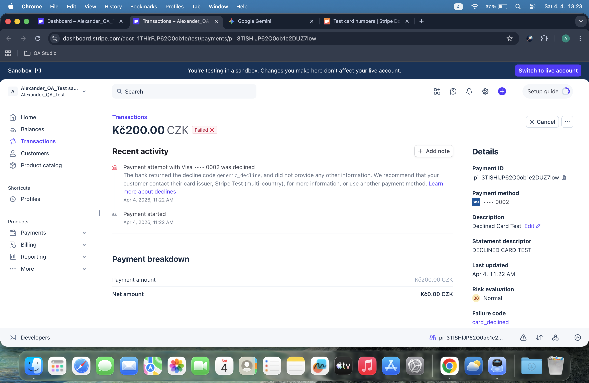

3. Insufficient Funds 💸

4. Expired Card 📅

5. Network / Processing Error ⚠️
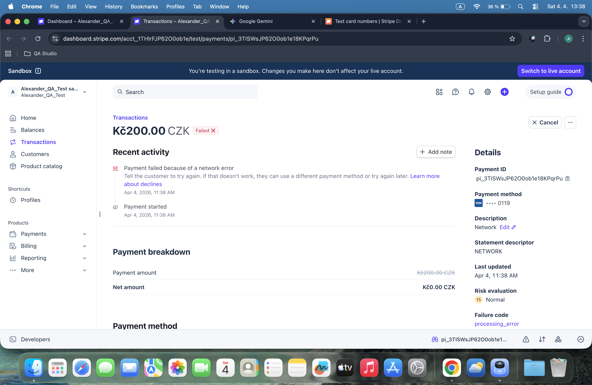

## Day 3: Stripe Webhooks & Theory

In this stage, I focused on understanding how Stripe communicates with our server using Webhooks.

### 1. Technical Concept
* **Webhook:** An automated message sent by Stripe when an event occurs (e.g., payment success).
* **Purpose:** To keep our database in sync with real-time payment statuses.

### 2. Implementation Workspace
I accessed the Stripe Workbench to review the webhook endpoints.

### 3. Documentation
Detailed explanation of webhooks can be found in [webhook_explanation.txt](./payment-setup/Day-03/webhook_explanation.txt).	

# Stripe API Testing - Day 4

This folder contains API request tests performed using Postman.

## Requests Performed:
1. **Create Successful Charge**: Verified payment processing with a valid test card.
2. **Create Declined Charge**: Verified system behavior when a card is declined.
3. **Retrieve Charge Details**: Fetched details of an existing transaction using its ID.

## Screenshots:

---

## Day 5: Refund Flow & Verification
In this session, I handled the post-payment lifecycle by processing a refund and verifying its status.

1. **Create Refund**: Sent a `POST` request to `/v1/refunds` using a specific Charge ID (`ch_...`).
2. **Retrieve Refund Status**: Verified the refund details and confirmed the status via a `GET` request.

### Screenshots (Day 5):
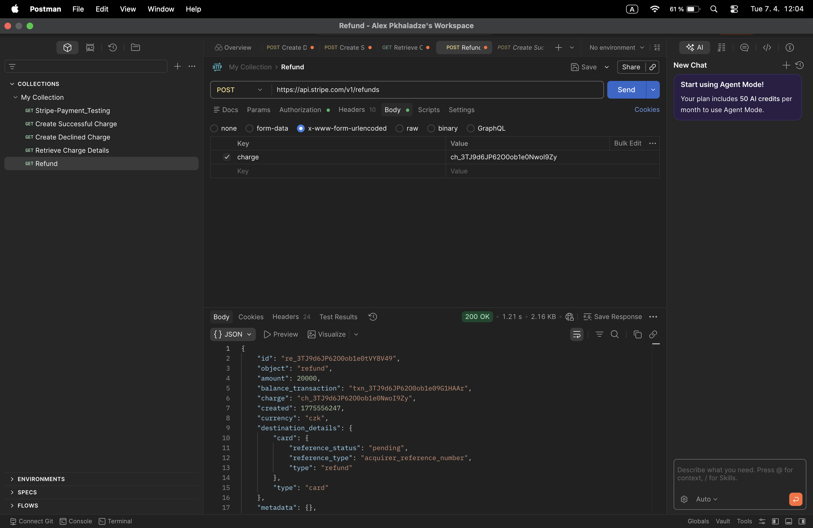
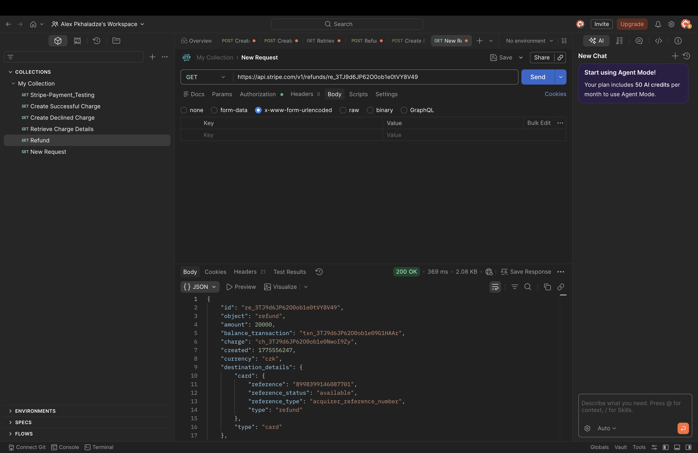

### Key Takeaway:
Successfully linked a refund to an existing charge and confirmed that Stripe correctly updates the transaction's lifecycle status to reflect the reversal of funds.

---

## Day 6: Stripe API Python Setup
Transitioned from Postman to automation using the **Stripe Python SDK**.

1. **Environment Configuration**: Set up secure API key management using environment variables.
2. **Charge Creation**: Successfully automated a $25.00 payment via a Python script.

### Files & Screenshots (Day 6):
* [Python Code](./api-testing/Day-06-Stripe-Charge-Creation-Basics/stripe_test_day6.py)
* 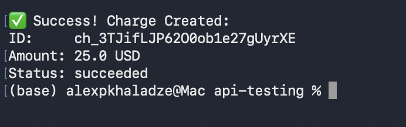

---

## Day 7: Stripe API Error Handling
Focused on system resilience and handling payment failures.

1. **Simulated Failure**: Used `tok_chargeDeclined` to trigger an intentional card rejection.
2. **Exception Handling**: Implemented `try-except` blocks to catch and display user-friendly error messages from Stripe's API.

### Files & Screenshots (Day 7):
* [Python Code](./api-testing/Day-07-Stripe-API-Error-Handling/stripe_test_day7.py)
* 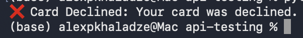

### Key Takeaway:
Learned that robust API integration isn't just about successful paths, but also about gracefully managing real-world scenarios like declined cards.
---

# Day 8: Stripe API Practice (Repetition)

Today I practiced handling successful and declined payments using the Stripe Charge API.

### Successful Payment
* [Success Case Code](./api-testing/Day-08-Repetition/practice_success.py)

### Declined Payment (Error Handling)
* [Error Case Code](./api-testing/Day-08-Repetition/practice_error.py)
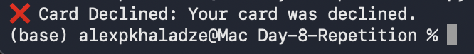

# API Testing & Fintech Learning
---
## Day 9: Stripe Refund Automation
### Overview
Automated the process of creating a charge and immediately issuing a full refund using the Stripe API.

### Implementation & Results
* [Refund Script Code](./api-testing/Day-09-Stripe-Refund-Automation/stripe_refund.py)
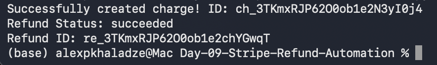

---

## Day 10: SQL Database Setup
### Overview
Created a local SQLite database to store and manage transaction data. Defined a schema and populated it with test data.

### Implementation & Results
* [SQL Database File](./api-testing/Day-10-SQL-Transactions/payments.db)
* [SQL Setup Script](./api-testing/Day-10-SQL-Transactions/test_transactions.sql)
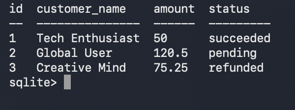

---

## Day 11: Advanced SQL Queries
### Overview
Practiced data retrieval techniques using SQL. Performed filtering and aggregation on the transactions database.

### Tasks Performed:
1. **Fetch All Data**: Verified all records in the table.
2. **Filtered Selection**: Selected transactions with a `succeeded` status.
3. **Data Aggregation**: Calculated the total revenue using the `SUM()` function.

### Implementation & Results
* [SQL Queries File](./api-testing/Day-11-SQL-Queries/queries.sql)
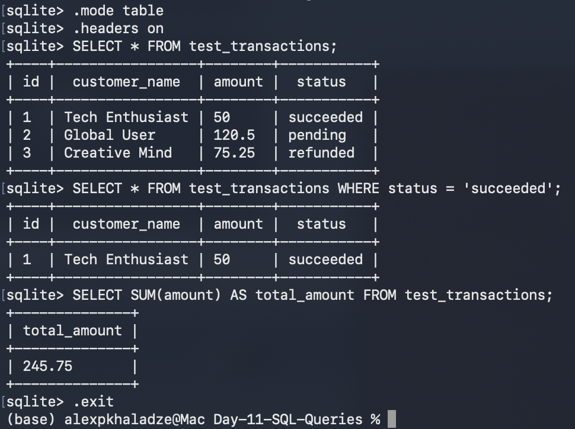

---

## Day 12: Database Verification Script
### Overview
Developed a Python script to bridge the gap between backend logic and the database. The script automates data retrieval and performs calculations on transaction records.

### Tasks Performed:
1. **Database Connection**: Established a secure connection to the SQLite database using Python.
2. **Data Extraction**: Executed SQL queries within the script to fetch all transaction details.
3. **Automated Calculation**: Implemented logic to calculate the total amount paid across all records.

### Implementation & Results
* [Python Verification Script](./api-testing/Day-12/verify_payment.py)
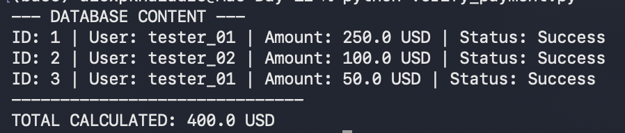

### Key Takeaway:
Practiced the "Code-to-Database" workflow, ensuring that data stored in SQL can be accurately processed and validated using Python logic.

---

## Day 13: Reflections & Integration Summary
### Overview
Synthesized the knowledge gained from working with SQL and Python automation. Documented the key lessons on how these tools work together in a payment testing environment.

### Key Learnings:
1. **SQL for Payment Testing**: Learned to use SQL as a "truth checker" to verify transaction data (amount, currency, status) directly in the database.
2. **Python-SQL Connection**: Mastered the "bridge" concept—using Python libraries and cursors to automate database tasks.
3. **The "Connection Chain"**: Explored how real-time actions (like Stripe clicks) sync with backend databases.

### Implementation & Results
* [Detailed Learning Log](./payment-setup/Day-13/learnings.md)

### Key Takeaway:
Understanding the flow from a user's action to a Python script and finally to a SQL database entry is crucial for full-stack payment testing.
---

## Day 14: Payment Flow Documentation
### Overview
Documented the end-to-end payment lifecycle, visualizing how a user action triggers an API process, updates the system's database, and is finally verified by a QA tester using SQL.

### Tasks Performed:
1. **Flow Visualization**: Created a **Mermaid Sequence Diagram** to map the interaction between the User, Stripe API, and the Database.
2. **Architecture Mapping**: Detailed the step-by-step logic from the "Pay" button click to the SQL verification.
3. **Verification Logic**: Documented the specific SQL query used to check the final state of a transaction in the database.

### Implementation & Results:
* [Detailed Payment Flow Documentation](./payment-setup/Day-14/payment-flow.md)

### Key Takeaway:
Visualizing the flow helped bridge the gap between frontend actions and backend database updates. It clarified how Stripe Webhooks serve as the messenger that tells our database to update a record, which we then verify using SQL queries.

## Day 15: Stripe Webhook Verification via Postman
### Overview
Returned to Postman to trigger a real-time event and verify the system's external communication via Webhooks. This session focused on how an API request triggers an asynchronous notification (Webhook) in the Stripe ecosystem.

### Tasks Performed:
1. **API Request (Postman)**: Created a `POST` request to `/v1/charges` to simulate a $25.00 payment using Stripe's test environment.
2. **Webhook Monitoring**: Accessed the Stripe Dashboard's Workbench to monitor incoming events triggered by the API call.
3. **Event Validation**: Verified that the `charge.succeeded` event was correctly generated with the matching transaction details (amount, currency, and ID).

### Implementation & Results:
* [Day 15 Task Folder](./api-testing/Day_15_stripe_webhook_event/)
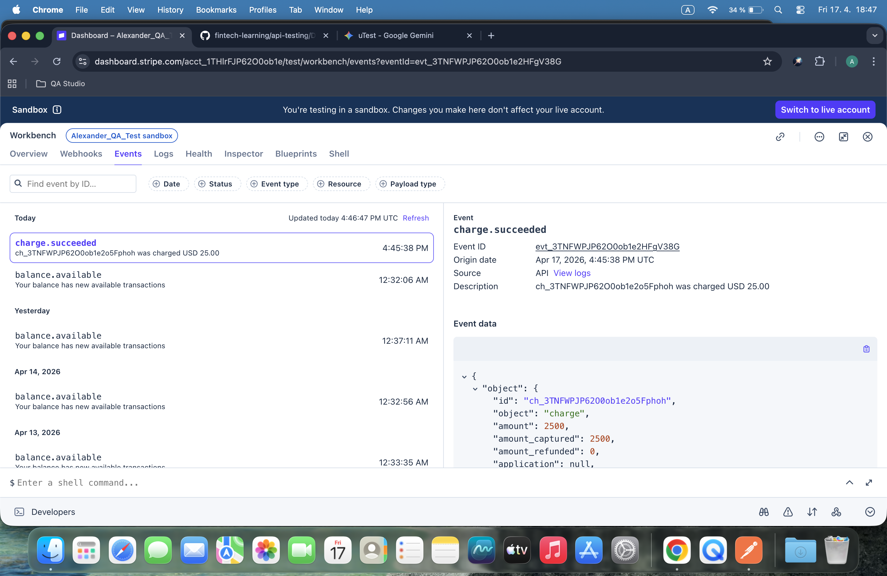

### Key Takeaway:
Confirmed the link between a manual API call (Postman) and the automatic notification system (Webhooks). This is a critical step in payment testing, as it ensures that the backend and third-party services stay in sync after a transaction is processed.

---

## Day 16: Webhook Concepts & Simulation
### Overview
Explored the theoretical and practical foundation of Webhooks. Created a Python-based simulation to understand how a system "listens" for asynchronous events from third-party services like Stripe.

### Tasks Performed:
1. **Conceptual Documentation**: Explained the "Push" mechanism of webhooks vs. the "Pull" mechanism of standard APIs via code comments.
2. **Simulation Script**: Developed `webhook_listener.py` to simulate a server waiting for incoming event data.
3. **Data Structure Mapping**: Defined a sample JSON payload representing a `charge.succeeded` event to visualize the data structure received by a webhook.

### Implementation & Results:
* [Day 16 Task Folder](./api-testing/Day_16_Webhook_Concept/)
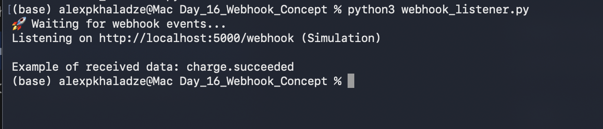

### Key Takeaway:
Learned that Webhooks act as "Messengers"  that notify our system automatically when an event occurs. Understanding the JSON payload structure is vital for QA testing to verify that the backend correctly processes these automated notifications.

## Day 17 
### Fintech QA Progress Report (Days 1-16):

## 1. What I've Built
* **Stripe Environment**: Set up a functional Sandbox environment for risk-free testing.
* **Manual Testing**: Used Postman to verify charge creation, declines, and refund flows.
* **Python Automation**: Developed scripts to automate payments and handle API errors gracefully.
* **Database Integration**: Created an SQLite database to store transactions and verified them using Python logic.
* **Webhook Architecture**: Visualized payment flows and built a simulation for real-time notifications.

## 2. What I Understand Now
* I understand how an API request (POST/GET) travels from a client to a server and back.
* I can read and parse JSON data to extract specific transaction details like status and amount.
* I understand the role of SQL as a "source of truth" for verifying if an API action actually updated the system.
* I am comfortable using Git/GitHub to document and version-control my work.

## 3. What's Still Confusing
* Connecting all parts (Stripe -> Webhook -> Python -> SQL) into one seamless automation flow still feels complex.
* Handling very large, nested JSON objects in Python requires more practice.

## 4. Next Skills to Learn
* Learning **pytest** to write professional-grade automated tests.
* Understanding **Mocking** to test APIs without needing a real connection every time.

---

## Day 18: SQL Database Infrastructure & QA Queries

### Overview
Transitioned to hands-on SQL database management using the terminal (SQLite). Focused on data integrity, schema constraints, and professional QA reporting via localized queries.

### Tasks Performed:
1. **Database Creation**: Initialized the `fintech_qa.db` database file directly via the command line.
2. **Schema Design**: Built a `customers` table with a `CHECK` constraint to ensure only valid payment methods (Visa, Mastercard, Amex) are accepted.
3. **Data Ingestion**: Populated the database with test customer records to simulate a real fintech user base.
4. **QA Reporting**: Executed specialized SQL queries to filter by card type, perform counts, and sort financial data for analysis.

### Implementation & Results:
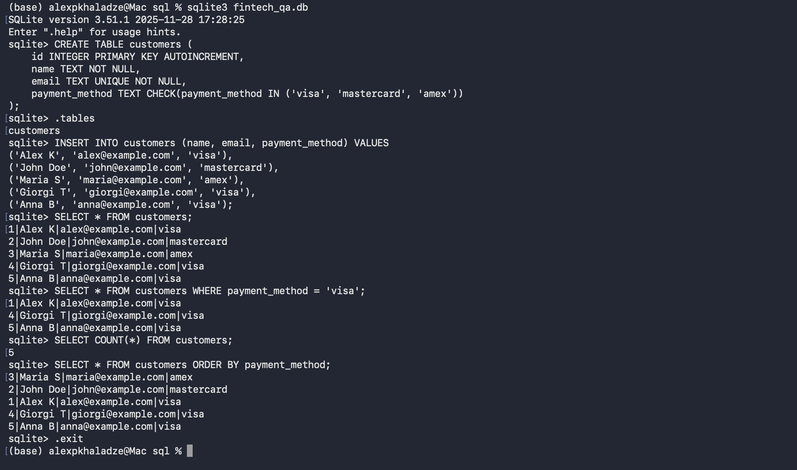

---

## Day 19: Python & SQL Integration (Data Analysis)
### Overview
Automated the data retrieval process by connecting a Python script to the existing SQLite database. This mimics a real QA scenario where backend data needs to be validated through code.

### Tasks Performed:
1. **Database Bridge**: Created a connection between Python and the `fintech_qa.db` stored in the payment infrastructure folder.
2. **Dynamic Querying**: Developed a script to extract customer names and payment methods automatically.
3. **Data Verification**: Implemented automated counting of database records to ensure data consistency.

### Implementation & Results:
* [Python Script](./api-testing/Day_19_Python_SQL_Analysis/customer_query.py)
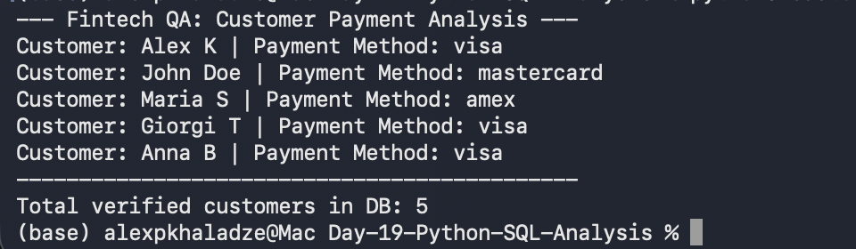

### Key Takeaway:
Learned how to use Python to interact with raw SQL data. This is crucial for automated regression testing, where we need to verify that a transaction was correctly recorded without manual DB checks.
---

## Day 20: Payment System Quality Assurance (QA)
### Overview
Shifted focus from technical implementation to structured testing documentation. Developed a comprehensive test suite to ensure the reliability and security of the Stripe payment integration.

### Tasks Performed:
1. **Test Case Design**: Authored 10 detailed manual test cases covering Positive (Success), Negative (Declined), and Edge cases.
2. **Error Handling Validation**: Defined scenarios for insufficient funds, expired cards, and incorrect CVC codes.
3. **Backend & Data Integrity**: Included test cases for Webhook verification and Database synchronization checks.

### Implementation & Results:
* [Manual Test Case Document](./payment-setup/Day_20_Payment_Validation_Documentation/payment_test_cases.md)

### Key Takeaway:
Quality is not just about writing code; it's about anticipating failure points. Today's task reinforced the importance of systematic documentation in the software development lifecycle (SDLC).
