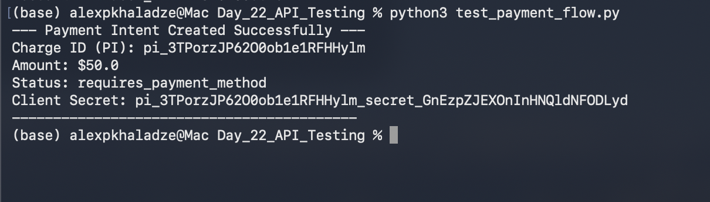

# 📅 Day 22: API Testing & Database Verification

## 🎯 Goal
The objective of this session was to transition from manual Stripe Dashboard testing to **automated API-driven payment creation** using Python, and to manually verify data integrity within the local SQLite database.

## 🛠️ Tech Stack
- **Language:** Python 3.x
- **API:** Stripe API
- **Database:** SQLite3
- **Security:** Environment Variables for Secret Keys

## 🚀 Deliverables

### 1. Automated Payment Script
I developed a Python script `test_payment_flow.py` that securely connects to Stripe using environment variables and generates a `PaymentIntent`.

* **View Code:** [`test_payment_flow.py`](./test_payment_flow.py)
* **Result:** The script successfully generated a Charge ID (`pi_...`).



### 2. Database Verification
After the successful API call, I manually inserted the transaction details into the `payments` table in `fintech_main.db` to simulate the data persistence layer.

```sql
SELECT * FROM payments WHERE stripe_charge_id = 'pi_3TPorzJP6200ob1e1RFHHylm';