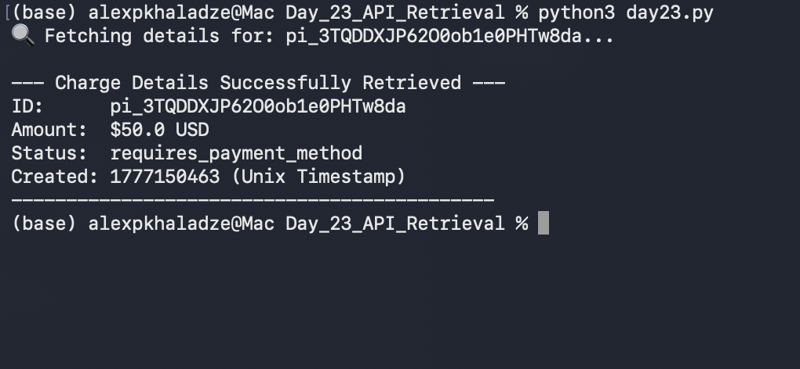

# 📅 Day 23: API Retrieval & File Automation

## 🎯 Goal
The goal was to simulate a scenario where a QA engineer needs to verify a specific charge by its ID, which is stored in an external file.

## 🚀 Steps Taken
1. **Manual Setup:** Created a $50.00 charge manually on Stripe Dashboard.
2. **Data Storage:** Saved the generated Payment ID into `charge_id.txt`.
3. **Automation:** Wrote `day23.py` to:
   - Read the ID from the file.
   - Fetch real-time data from Stripe API.
   - Print verification details.

## 📊 Results
Successfully retrieved:
- **Amount:** $50.00
- **Status:** Requires Payment Method
- **ID:** pi_3TQDDXJP6200ob1e0PHTw8da

