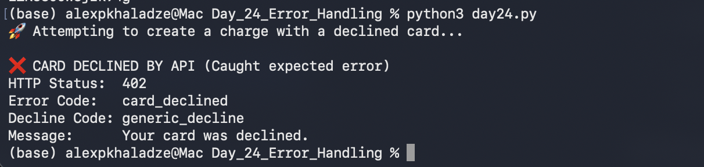

# 📅 Day 24: API Error Handling (Negative Testing)

## 🎯 Goal
Test how the system handles a declined payment and verify that the API returns the correct error codes and messages.

## 🚀 Steps Taken
1. **Manual Verification:** Created a declined charge in Stripe Dashboard using `tok_chargeDeclined`.
2. **Observation:** Captured the manual error message: *"Your card was declined. The bank returned the decline code generic_decline..."*
3. **Automation:** Developed `day24.py` using a `try-except` block to catch `stripe.error.CardError`.
4. **Validation:** Verified that the API returns HTTP 402 and the matching decline code.

## 📊 Results
- **Expected Message:** Your card was declined.
- **Actual API Message:** Your card was declined.
- **Error Code:** card_declined
- **Decline Code:** generic_decline

