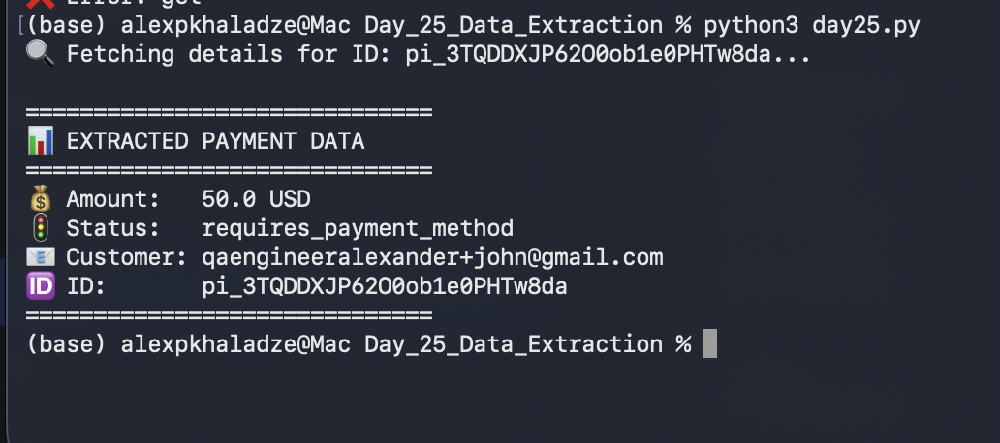

# 📅 Day 25: Data Extraction & Retrieval

## 🎯 Goal
Practice retrieving specific data from the Stripe API using a unique ID and extracting key business fields.

## 🚀 Steps Taken
1. **Manual:** Identified a successful/pending charge ID from the Stripe Dashboard.
2. **Automated:** Created `day25.py` to fetch data using `stripe.PaymentIntent.retrieve`.
3. **Data Filtering:** Extracted specifically:
   - Amount (converted from cents)
   - Currency
   - Status
   - Customer Email
4. **Validation:** Confirmed that API data matches the record in the Dashboard.

## 📊 Results
