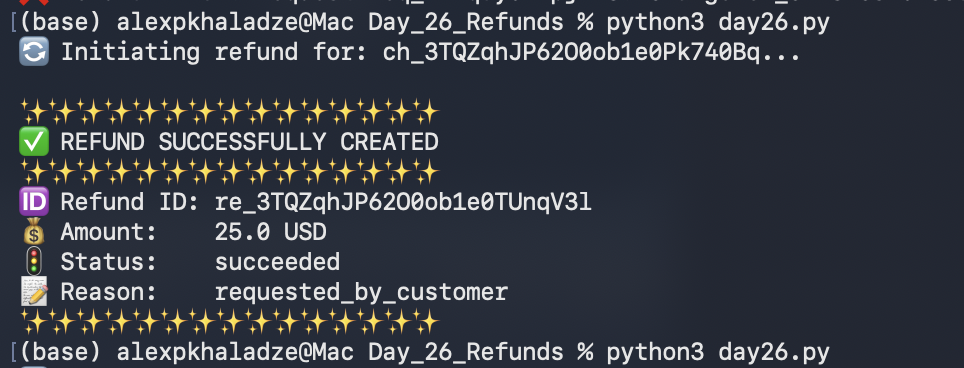

# 📅 Day 26: Refund Processing & API Validation

##  Goal
Automate the refund process using the Stripe API and verify the refund status, amount, and reason.

##  Steps Taken
1. **Manual:** Performed a manual refund in the Dashboard and identified the `re_` (Refund ID) format.
2. **Automated:** Developed `day26.py` using `stripe.Refund.create`.
3. **Logic Handling:** Implemented universal ID handling for both `ch_` and `pi_` prefixes.
4. **Data Extraction:** Converted the Stripe response object to a dictionary for safe field retrieval.

##  Results
- **Refund Status:** succeeded
- **Reason:** requested_by_customer
- **Verification:** The original charge in Dashboard now shows as "Refunded".

