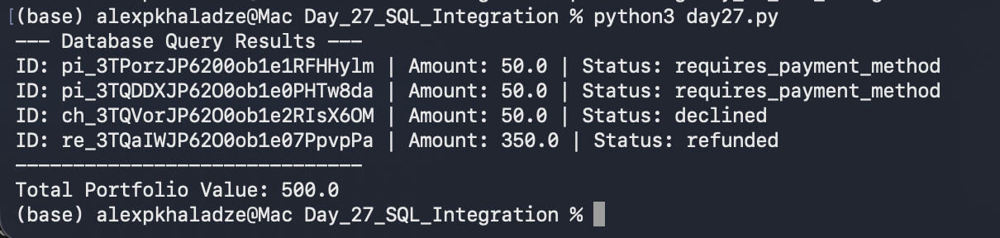

# 📅 Day 27: SQL Database Integration

##  Goal
Synchronize API data with a persistent SQL database and perform data aggregation using Python.

##  Steps Taken
1. **Database Setup:** Accessed `fintech_main.db` in `global_data` folder.
2. **Manual Entry:** Created `payments` table and manually inserted 3 records from previous days (Day 23-26).
3. **Automation:** Developed `day27.py` to:
   - Establish a connection to the SQLite database.
   - Query all payment records.
   - Calculate the total portfolio value (sum of all amounts).
4. **Data Validation:** Verified that the script correctly pulls data that was manually inserted.

##  Results
- **Total Records Processed:** 4
- **Total Portfolio Value:** 500.0 (Note: Contains mixed currencies USD/GEL)

