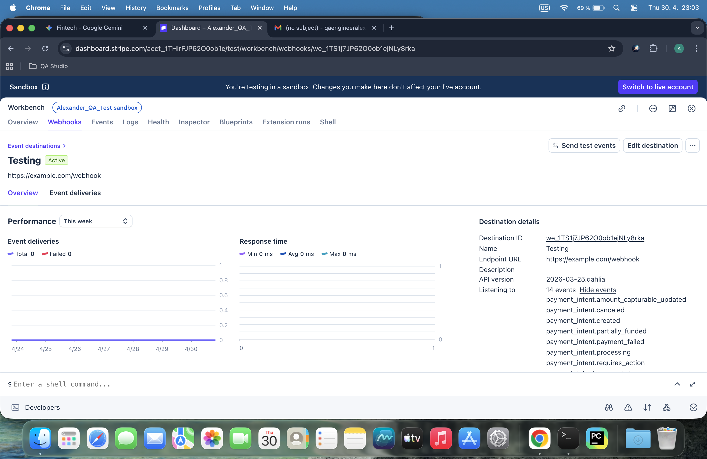
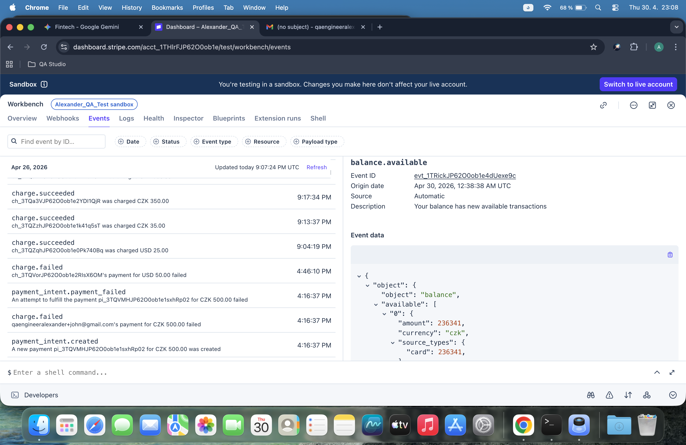
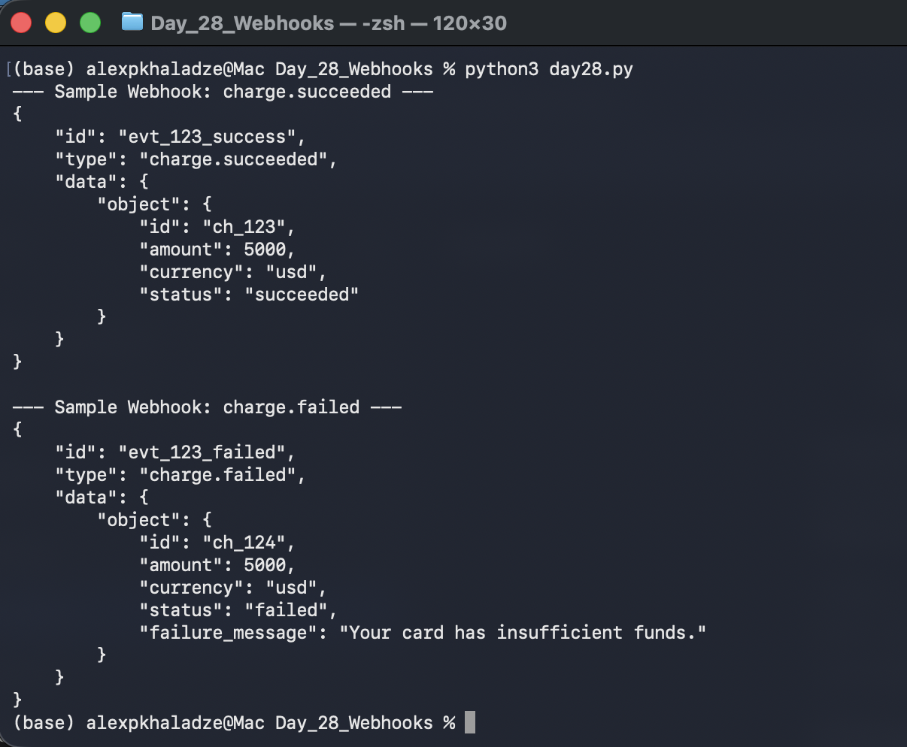

# 📅 Day 28: Stripe Webhooks Integration

## 🎯 Project Goal
The goal of today’s task was to transition from manual API polling to an event-driven architecture by configuring Stripe Webhooks and understanding the JSON payload structure.

## 🛠️ Tasks Completed

### 1. Manual Setup (Stripe Dashboard)
- Navigated to the **Developers > Webhooks** section in Stripe Workbench.
- Created a new Webhook endpoint pointing to a test URL (`https://example.com/webhook`).
- Subscribed to specific events:
    - `charge.succeeded`
    - `charge.failed`
- Verified the setup and explored the **Events** log to see historical payment data.

### 2. Automated Script (`day28.py`)
- Developed a Python script to simulate incoming Webhook data.
- Defined sample JSON structures for both successful and failed payment events.
- Printed formatted JSON outputs to visualize how the system will receive and process data in the future.

## 📁 Artifacts & Proofs
- **Dashboard Setup:** 
- **Events History:** 
- **Python Output:** 

## 💡 Key Learnings
- **Webhooks vs API:** Webhooks allow Stripe to "push" data to us instantly, rather than us "pulling" it manually.
- **JSON Structure:** Understanding the `data -> object` hierarchy is crucial for extracting charge IDs and amounts in automated tests.