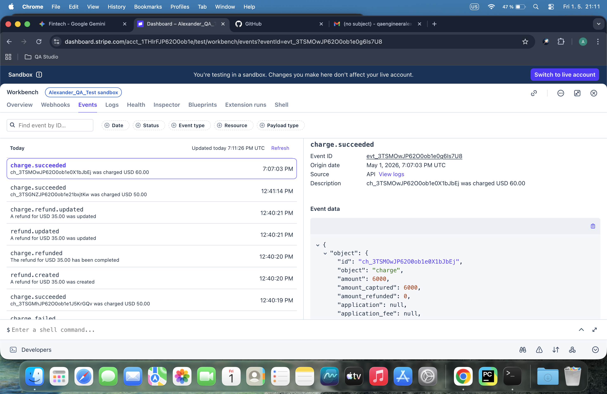
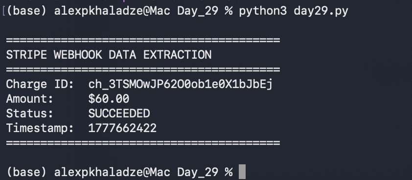

# 📅 Day 29: Parsing Real Stripe Webhooks

## 🎯 Project Goal
The objective of Day 29 was to move from simulated data to processing real JSON payloads from the Stripe Dashboard, extracting key financial information using Python.

## 🛠️ Tasks Completed

### 1. Manual: Capturing Real Data
- Created a real test charge of **$60.00** using a Python automation script.
- Located the `charge.succeeded` event in the Stripe Dashboard.
- Inspected the full JSON payload to understand the hierarchy of the data.
- **Proof:** 

### 2. Automated: JSON Parsing (`day29.py`)
- Integrated the raw JSON from Stripe into a Python script.
- Used the `json` library to decode the string format.
- Implemented logic to navigate the JSON structure and extract:
    - **Charge ID** (e.g., `ch_3TSMOw...`)
    - **Amount** (converted from cents to dollars)
    - **Status** (confirmed as `succeeded`)
    - **Timestamp** (Unix format)
- **Terminal Output:** 

## 📁 Files in this Folder
- `stripe6.py`: Script used to generate the test charge.
- `day29.py`: The main parsing script for today's assignment.
- `real_webhook_payload.png`: Screenshot of the Stripe Event data.
- `day29_terminal_output.png`: Screenshot of the successful data extraction in the terminal.

## 💡 Key Learnings
- **JSON Hierarchy:** Real-world API responses can vary in structure (e.g., some have a `data` wrapper, others use a direct `object` key).
- **Data Types:** Learned the importance of `json.loads()` for converting string-based JSON into searchable Python dictionaries.
- **Financial Precision:** Always dividing the Stripe `amount` by 100 to get the correct decimal value for currencies like USD.