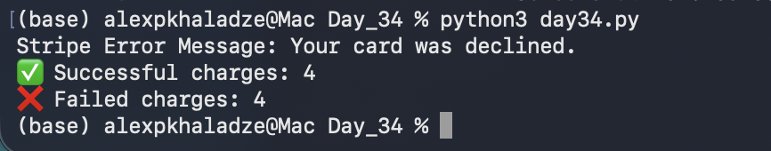

# Day 34: Exception Handling & Failure Logging

## Objective
The goal was to automate the capture of failed transaction attempts and log them into the database for financial auditing and reporting.

## Technical Tasks
- **Negative Testing:** Simulated a card decline using the `tok_chargeDeclined` token.
- **Exception Handling:** Implemented `try-except` blocks to catch `stripe.error.CardError` and extract the specific Stripe error message.
- **DB Reporting:** Inserted the failed charge into SQLite and performed a comparative count of "succeeded" vs "failed" transactions.

## Execution Result
The script successfully caught the decline, updated the database, and generated a status summary:

## Key Learning
Handling failures is as important as handling successes. I learned how to extract metadata from error objects (like `failed_charge_id`) to maintain a complete audit trail in the database.
