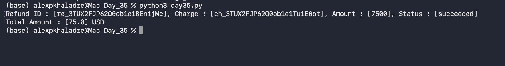

# Day 35: Automated Refund Tracking & Database Schema Expansion

## Objective
The goal was to automate the retrieval of refund data from Stripe and manage it within a dedicated database structure for cross-referencing with original charges.

## Technical Tasks
- **Schema Evolution:** Created a new `refunds` table in SQLite with relationships to original charge IDs.
- **API Integration:** Used `stripe.Refund.retrieve()` to fetch live data for a specific refund (`re_...`).
- **Data Persistence:** Automated the insertion of refund metadata into the database.
- **Financial Aggregation:** Implemented SQL queries to calculate the total amount of successfully processed refunds.

## Execution Result
The script successfully initialized the table and logged the transaction details:

## Key Learning
I practiced handling different Stripe object types (Refund vs Charge) and learned how to build multi-table database architectures to track a payment's full lifecycle.
