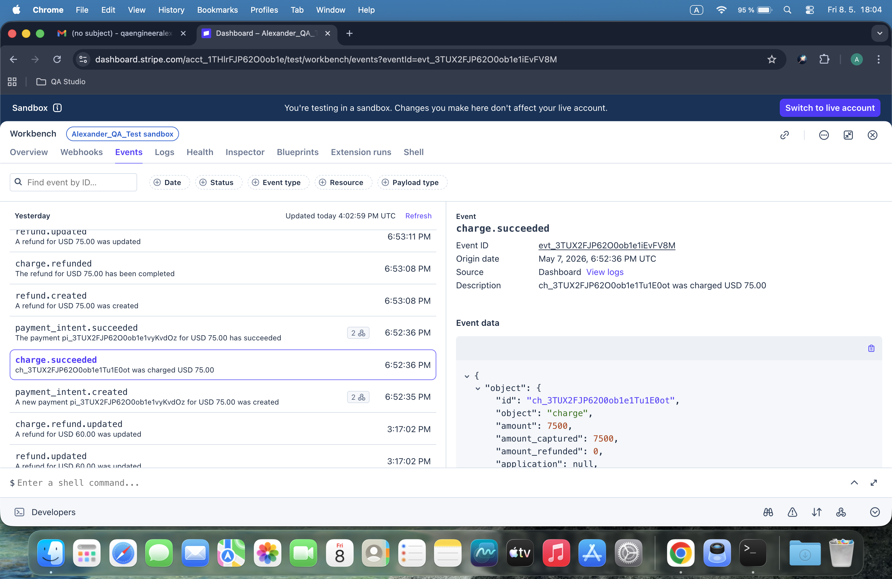
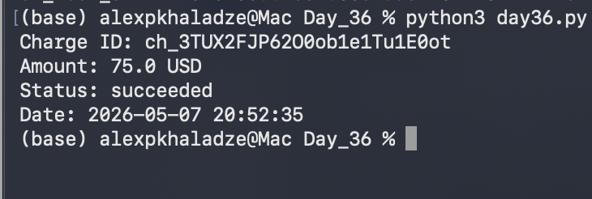

# Day 36: Webhook Analysis & JSON Parsing

## Objective
The goal was to understand how Stripe communicates real-time events via Webhooks and to practice parsing complex JSON payloads using Python.

## Technical Tasks
- **Manual Analysis:** Investigated the `charge.succeeded` event in the Stripe Workbench to understand its nested JSON structure.
- **JSON Parsing:** Used Python's `json` library to transform a raw string payload into a searchable dictionary.
- **Data Transformation:** Extracted the UNIX timestamp from the payload and converted it into a human-readable format using `datetime`.
- **Field Extraction:** Isolated critical transaction data: Charge ID, Amount (converted to USD), and Status.

## Visual Documentation
### Stripe Webhook Payload (JSON):

### Python Parsing Result:

## Key Learning
Webhooks are essential for event-driven architecture. I learned how to navigate deep JSON paths (e.g., `data["object"]["id"]`) to extract specific values needed for automated validation.
