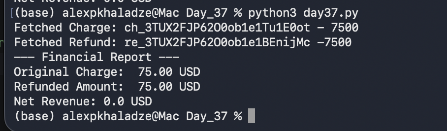

# Day 37: Financial Reconciliation & SQL Joins

## Objective
The goal was to link charges and their corresponding refunds in the database to calculate net revenue, simulating a real-world financial audit process.

## Technical Tasks
- **Transaction Lifecycle:** Manually created a charge and a subsequent refund in the Stripe Dashboard.
- **Data Integration:** Automated the retrieval of both objects via Stripe API and stored them in separate relational tables (`charges` and `refunds`).
- **Relational Query:** Used a `SQL JOIN` to connect the two tables based on the `charge_id`.
- **Business Logic:** Implemented a calculation for **Net Revenue** (Original Charge - Refunded Amount).

## Visual Documentation
### 1. Stripe Dashboard: Successful Charge

### 2. Stripe Dashboard: Processed Refund

### 3. Automated Financial Report (Python Output):

## Key Learning
I learned how to use relational database logic to bridge separate API objects. Calculating the Net Revenue automatically ensures data integrity for financial reporting.
