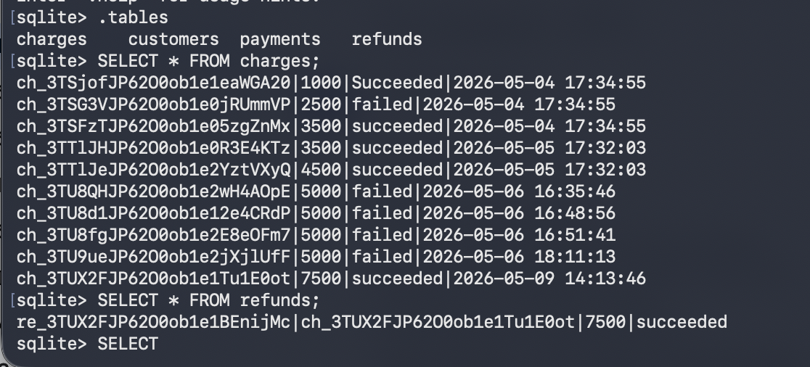
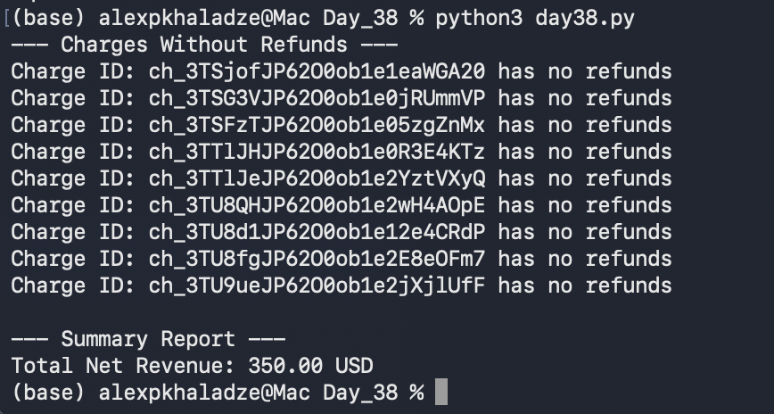

# Day 38: Advanced SQL Joins & Financial Reporting

## Objective
The goal was to perform a comprehensive financial audit by identifying unreconciled charges and calculating the total net revenue across all transactions using SQL.

## Technical Tasks
- **Database Audit:** Manually reviewed `charges` and `refunds` tables to map relationships.
- **Advanced Querying:** Implemented a `LEFT JOIN` with `IFNULL(r.amount, 0)` to ensure charges without refunds are still included in the calculation.
- **Automation:** Created a Python report that lists all charges currently without refunds and computes the final Net Revenue.

## Visual Documentation
### 1. Database State (Charges vs Refunds)

### 2. Automated Financial Summary

## Key Learning
I mastered the use of `LEFT JOIN` for identifying missing relationships in data. This is essential for finding "orphan" transactions or, in this case, charges that haven't been touched by a refund process yet.
