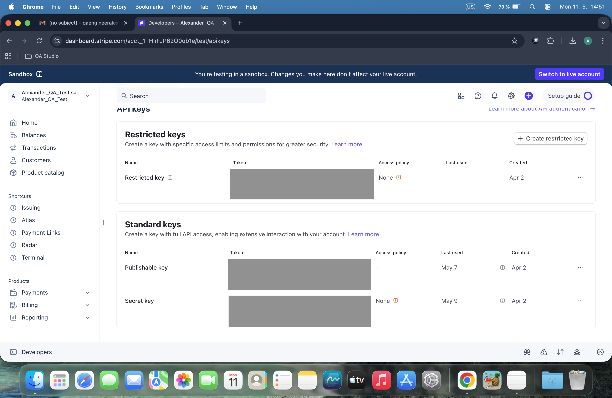
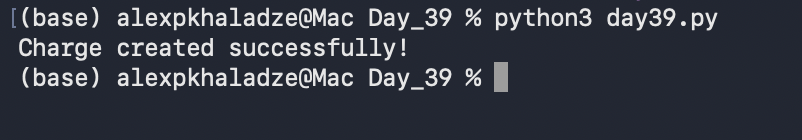

# Day 39: Secure API Key Management & Charge Creation

## Objective
The focus was on securing API credentials using environment variables and validating the connection by programmatically creating a test charge in Stripe.

## Technical Tasks
- **Security Best Practices:** Configured the Stripe Secret Key as an environment variable to prevent hardcoding sensitive data.
- **Validation Logic:** Implemented a check to ensure the API key is correctly loaded before making requests.
- **API Interaction:** Used the `stripe.Charge.create()` method to generate a new transaction in the sandbox environment.

## Visual Documentation
### 1. Stripe Dashboard: API Keys Configuration

### 2. Automated Charge Validation

## Key Learning
I learned why environment variables are critical for security in API testing. Successfully creating a charge via the script confirms that the integration setup is robust and ready for more complex automation.
