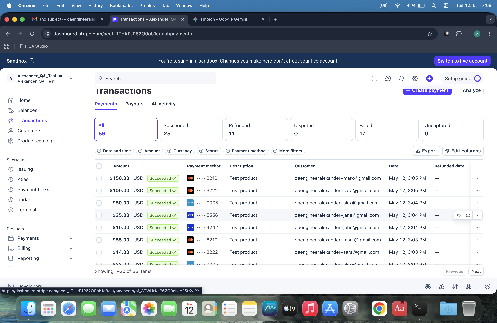
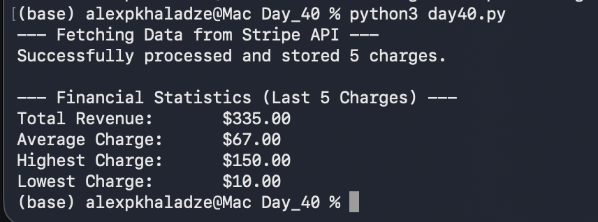

# Day 40: Data Aggregation & Financial Analytics

## Objective
The goal was to automate the collection of multiple transactions from Stripe, store them in a relational database, and perform statistical analysis to derive key financial metrics.

## Technical Tasks
- **Batch Data Fetching:** Used Stripe API to retrieve the last 5 successful charges.
- **Data Persistence:** Implemented `INSERT OR IGNORE` logic to store unique transactions in SQLite.
- **Financial Analytics:** Developed a Python script to calculate:
    - **Total Revenue** (Sum of all charges)
    - **Average Transaction Value**
    - **Highest & Lowest** payment amounts.

## Visual Documentation
### 1. Stripe Dashboard: Test Charges List

### 2. Automated Financial Report

## Key Learning
I learned how to transform raw API data into actionable financial insights. Mastering aggregation functions like `SUM()`, `MAX()`, and `MIN()` in Python is essential for building robust financial reporting tools.
