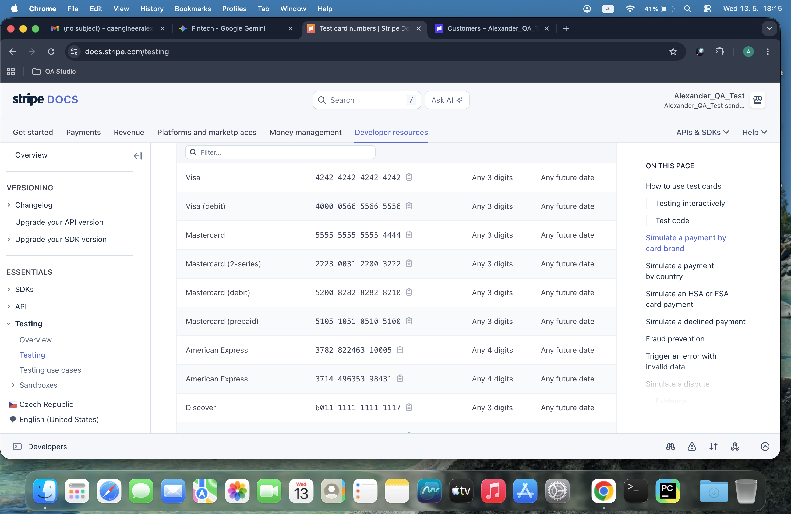
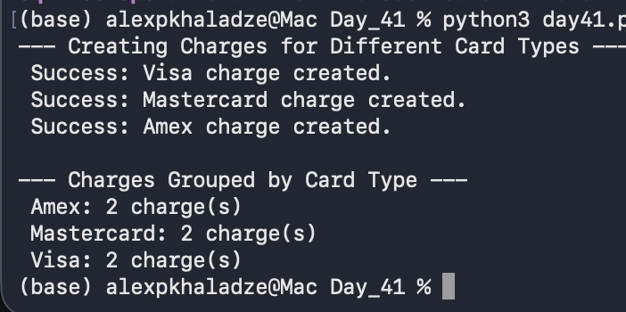

# Day 41: Multi-Card Support & Transaction Grouping

## Objective
The goal was to test and automate charges using different credit card brands (Visa, Mastercard, Amex) and perform data grouping within the database to analyze transaction distribution.

## Technical Tasks
- **Database Schema Evolution:** Dynamically updated the `charges` table to include a `card_brand` column using SQL `ALTER TABLE`.
- **Multi-Brand Testing:** Processed automated charges using various Stripe test tokens (`tok_visa`, `tok_mastercard`, `tok_amex`).
- **Data Analytics:** Implemented SQL `GROUP BY` logic to count transactions based on their card brand.

## Visual Documentation
### 1. Stripe Documentation: Test Card Numbers

### 2. Automated Card Brand Report

## Key Learning
I learned how to handle database schema updates and use aggregation functions to generate business insights. Understanding how different card types are processed and labeled in the API is crucial for building detailed financial dashboards.
