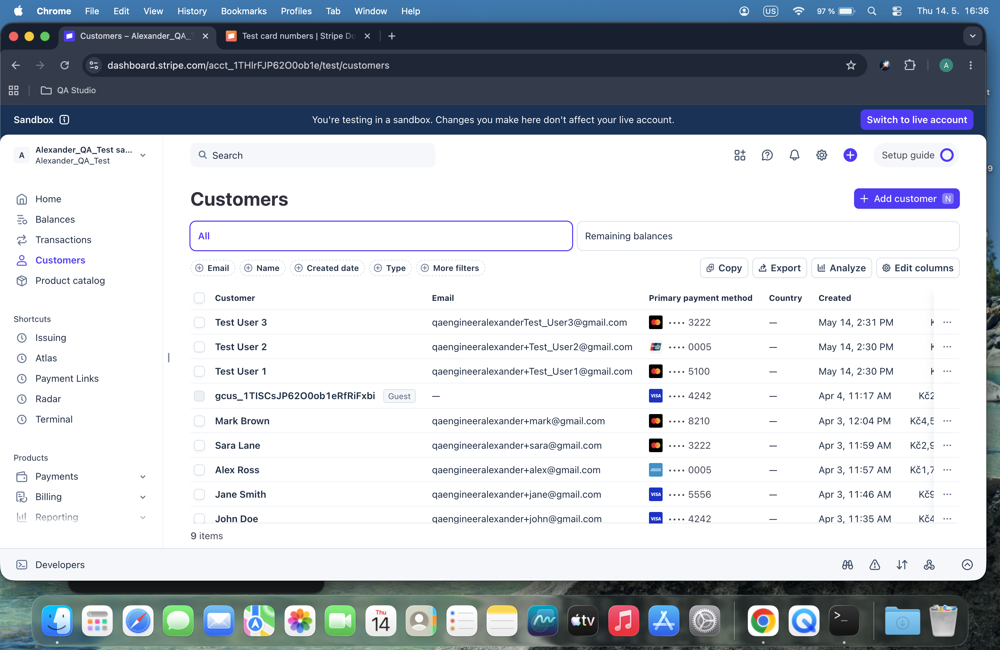

# Day 42: Customer Management & Data Synchronization

## Objective
The goal was to demonstrate proficiency in managing customer data via Stripe API and local SQLite persistence, ensuring consistency between cloud-based users and local records.

## Technical Tasks
- **Manual Verification:** Created test customers directly in the Stripe Dashboard to verify UI management.
- **API Automation:** Developed a Python script to dynamically create customer objects using the Stripe SDK.
- **Data Persistence:** Synchronized Stripe customer IDs, names, and emails into an existing SQLite relational database.
- **Querying:** Implemented detailed querying to list and verify all synchronized customer records.

## Visual Documentation
### 1. Stripe Dashboard: Customers Overview

### 2. Automated Customer Query Report

## Key Learning
I learned how to effectively map API responses to a local database schema. Mastering customer data synchronization is fundamental for building CRM (Customer Relationship Management) systems and subscription-based fintech platforms.
