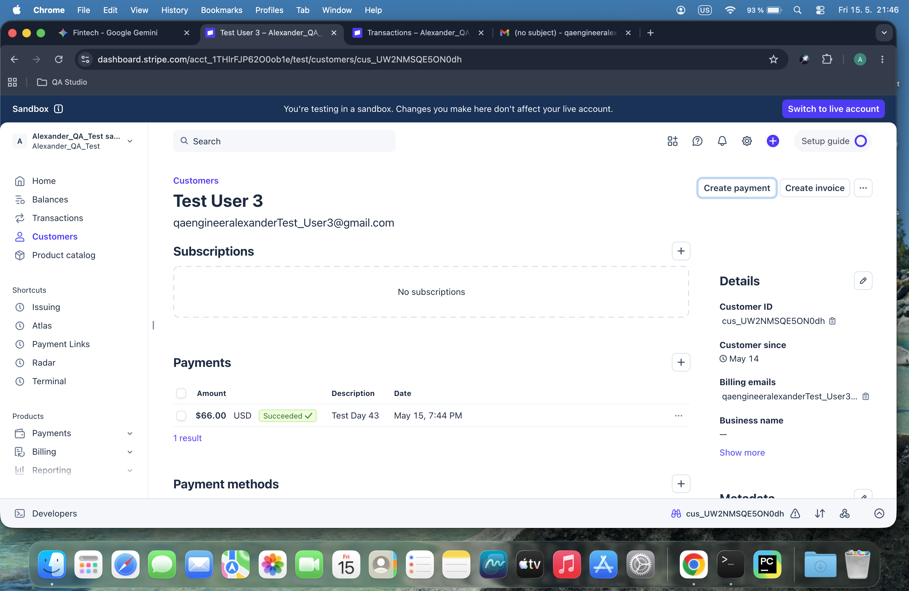
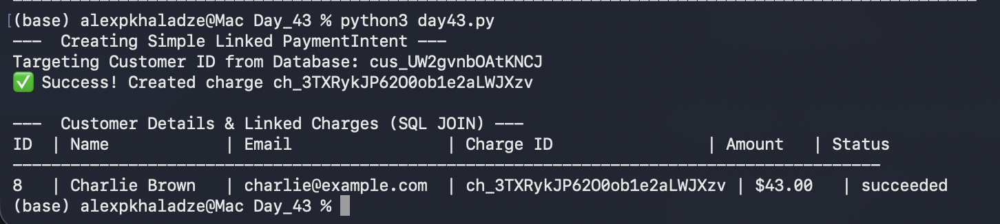

# Day 43: Advanced Database Joins & Payment Intents

## Objective
The goal was to link Stripe charges directly to automated customers and perform relational analysis using SQL  to generate clean, combined reports of customers and their financial activities.

## Technical Tasks
- **Modern API Integration:** Utilized Stripe's contemporary `PaymentIntent` API to safely process charges for modern customer objects.
- **Dynamic Identification:** Automated the script to query the latest customer from the database rather than hardcoding static IDs.
- **Relational Reporting:** Executed an SQL `INNER JOIN` across `customers` and `charges` tables to align transaction data with user profiles.

## Visual Documentation
### 1. Stripe Dashboard: Customer Linked Charge

### 2. Automated Customer Charges Join Report

## Key Learning
I learned how to structurally transition from legacy `Charges` to modern `PaymentIntents` in Stripe. Additionally, mastering multi-table relational queries (`JOIN`) is a core milestone for testing data integrity across complex financial ecosystems.
