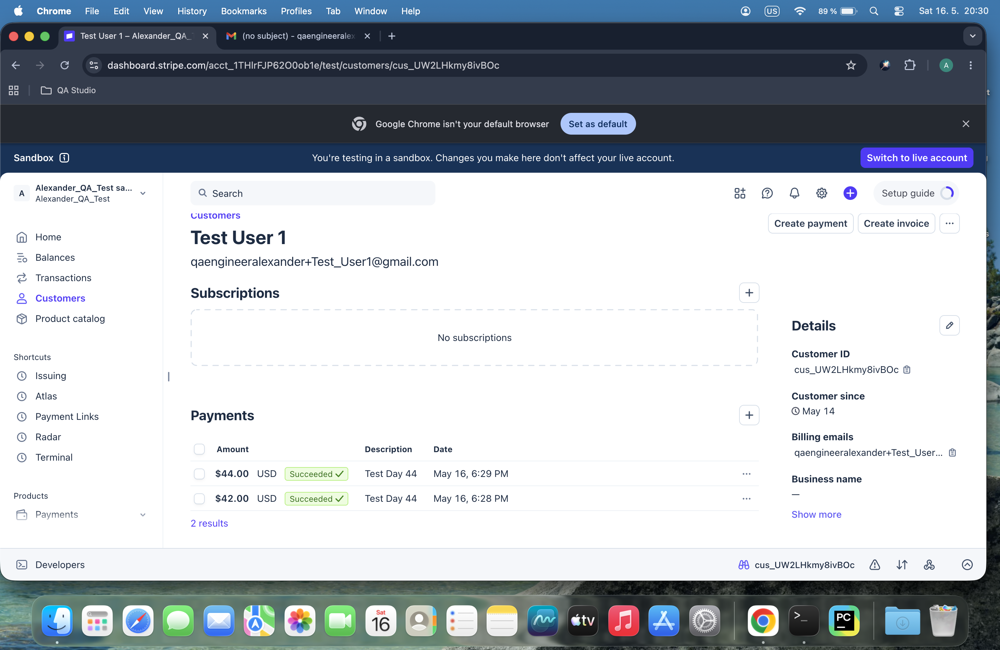
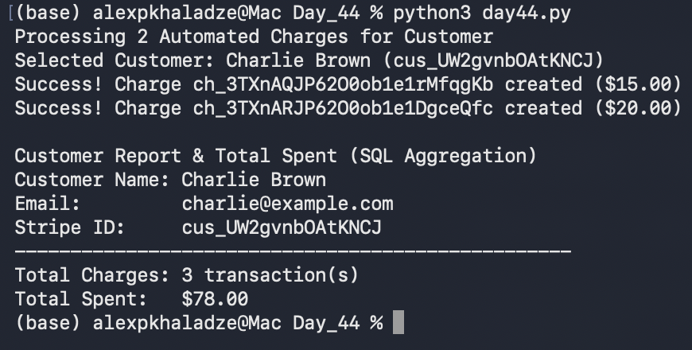

# Day 44: Multi-Transaction Aggregation & Analytics

## Objective
The goal was to process multiple automated charges for a specific customer and implement SQL aggregation functions (`SUM` and `COUNT`) to calculate metrics like total user lifetime value (LTV) directly from the database.

## Technical Tasks
- **Batch Processing:** Configured the automation script to hit Stripe's PaymentIntent API sequentially to generate multiple charges for a single user.
- **Data Persistence:** Stored all new transaction records linked to the specific customer's UUID.
- **SQL Aggregation:** Authored dynamic queries utilizing `SUM(amount_cents)` and `COUNT(charge_id)` to build financial reports on the fly.

## Visual Documentation
### 1. Stripe Dashboard: Multiple Customer Charges

### 2. Automated Financial Aggregation Report

## Key Learning
I learned how to use fundamental SQL analytical functions to derive business metrics from relational data. Simulating multiple payments per user and aggregating their statistics replicates true e-commerce backend behavior.
