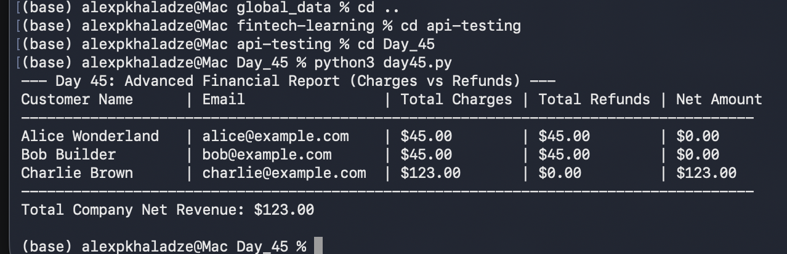
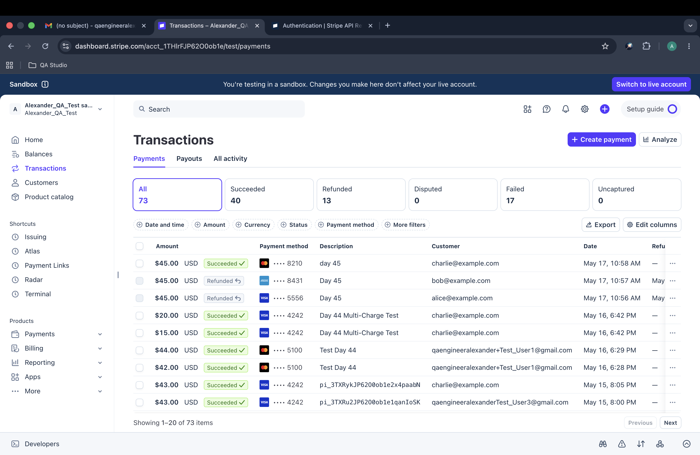

# Day 45: Advanced Financial Reporting (Charges vs Refunds)

## Objective
On Day 45, the project shifted toward data integrity and advanced financial querying within an e-commerce ecosystem by introducing Refunds. The task involved restructuring existing database tables to enforce strict relations, synchronizing real transaction logs from the Stripe Sandbox dashboard, and engineering an automated pipeline capable of compiling a global net-revenue statement.

## Technical Tasks
- **Database Schema Upgrades:** To support complex relational querying, the charges and refunds tables were rebuilt to properly leverage Primary Keys (pk). The charges table enforces the native Stripe Charge ID (ch_...) as a strict Primary Key, while the refunds table enforces a unique Stripe Refund ID (re_...) as its Primary Key, mapping directly to charges(charge_id).
- **Data Synchronization:** Manually aligned active state variables with today's Stripe Dashboard mutations. Transactions safely matched core profiles for Charlie Brown, Bob Builder, and Alice Wonderland.
- **Automated Report Script:** The pipeline runs a complex multi-table structure connecting customers, charges, and refunds. Utilizing LEFT JOIN and data cleaning formulas (COALESCE), the system safely builds dynamic matrix reports without risking row-omission bugs on zero-refund users.

### Financial Equation Applied:
Net Amount = Total Charges - Total Refunds

## Visual Documentation

### 1. Automated Financial Aggregation Report

### 2. Stripe Dashboard: Multiple Customer Charges

## Key Learning
- **Safe Migrations:** Mastered non-destructive schema adjustments through target staging backups.
- **Relational Resilience:** Leveraged explicit LEFT JOIN mechanics to securely maintain multi-branch financial accounting visibility.
- **Fintech Lifecycle Mastery:** Gained deep operational experience managing state flows tracking transactional lifecycle evolution from simple intent to completed reverse settlements.
