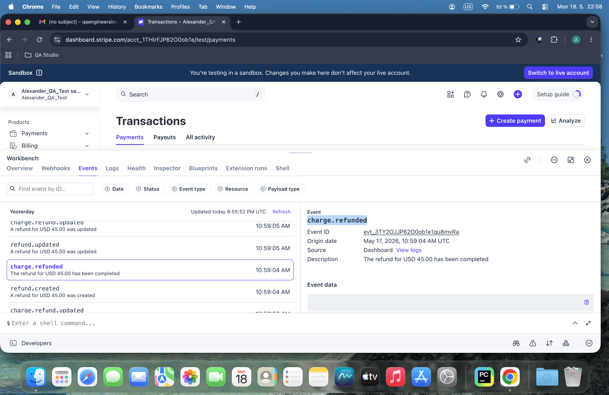
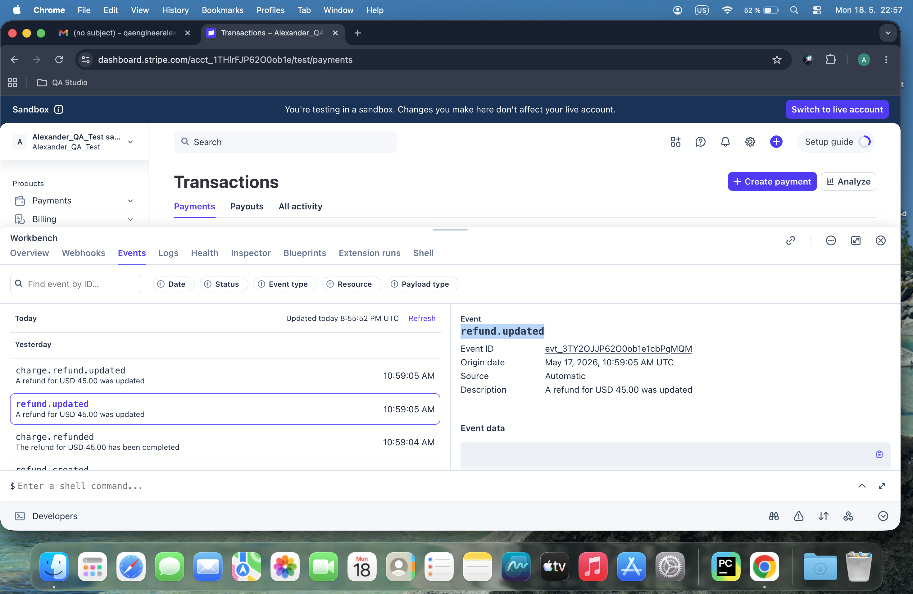

# Day 46: Stripe Webhooks Architecture & Payload Parsing

## Objective
The core focus of Day 46 was shifting from standard REST API polling to event-driven architectures. The objective involved analyzing real asymmetric event payloads directly from the Stripe Sandbox log stream, isolating structured metadata configurations, and writing an extensible Python service layer capable of routing discrete automation workflows based on native webhook action types.

## Technical Tasks
- **Manual Event Auditing:** Inspected production event logs inside the Stripe Dashboard Workbench to map structural variants across multiple lifecycle mutations like status adjustments and state transfers.
- **Payload Synthesis:** Engineered localized runtime mock data arrays replicating authentic multi-layer nested JSON payload objects for various transactional and user events.
- **Asymmetric Parsing Pipeline:** Built a centralized algorithmic routing solution (`day46.py`) utilizing logical type matching to extract business-critical identifiers across deeply nested nested object schemas safely.

## Visual Documentation

### 1. Stripe Workbench: Charge Succeeded Event Log

### 2. Stripe Workbench: Charge Refunded Event Log

### 3. Stripe Workbench: Refund Created Stream

### 4. Stripe Workbench: Refund Updated Mutation

## Key Learning
- **Asymmetric Schema Mapping:** Gained deep operational knowledge on how event objects maintain entirely unique schemas wrapped within a standardized top-level Stripe event container.
- **Event-Driven Resilience:** Understood the baseline requirements for webhook ingestion systems, preparing for asynchronous microservices capable of handling immediate state synchronization without system blockages.
- **Type Routing Resolution:** Mastered defensive JSON unpacking methods to decouple main application state engines from API provider mutation types.
