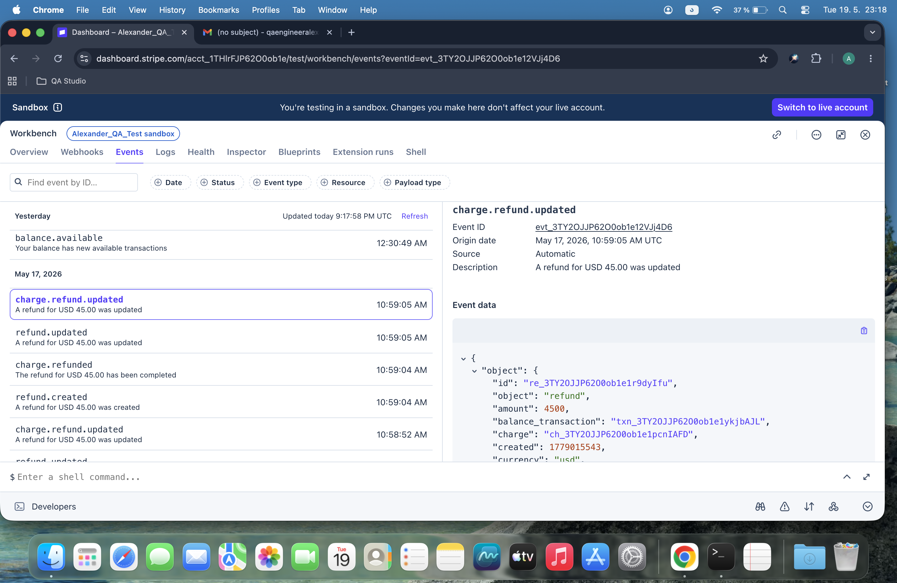

# Day 47: Strategic Analysis of Stripe Webhook Events & Matrix Mapping

## Objective
The core objective of Day 47 was to deeply analyze lifecycle behaviors of operational transaction events from the Stripe API framework and build an extensible dictionary automation script (`day47.py`). The focus rested on assessing payment processing failures, reverses, and successful capture states to establish comprehensive payment simulation test plans.

## Technical Tasks
- **Webhook Analytical Auditing:** Conducted documentation mining of Stripe's native Event catalog to isolate transactional behaviors under ideal and non-ideal execution paths.
- **Data Dictionary Synthesis:** Authored a structural relational database mock mapping dictionary structure that holds programmatic definitions, firing contexts, and payload schema dependencies.
- **Automation Pipeline Architecture:** Implemented a clean iterator method designed to traverse core matrices and cleanly stream telemetry output parameters to console logs.

## Event Breakdown & QA Testing Notes

### 1. charge.succeeded
This event triggers immediately after a customer's payment instrument is successfully authorized and captured by the financial processor. From a testing architecture perspective, this serves as the primary optimistic flow validation signal to safely unlock downstream features, dispatch inventory, or generate database transaction profiles. In automated testing matrices, mocking this event validates that system state handlers properly move a transaction record from a pending layout to a completed settlement status.

### 2. charge.failed
This event fires in real-time when an authorization attempt is rejected due to insufficient funds, strict fraud protection rules, expired card attributes, or network routing timeout failures. For backend validation architectures, this represents a critical edge case to verify that user flow controls intercept negative state mutations, gracefully retain order integrity, and present intuitive troubleshooting logs. Simulating this event ensures that subsequent processes like order provisioning are instantly locked and that user error channels function properly.

### 3. charge.refunded
This event is emitted asynchronously whenever a completed transaction settlement is either partially reversed or fully returned via manual dashboard adjustments or programmatic refund calls. During fintech application validation routines, intercepting this payload is paramount to verify that the target accounting ledger cleanly subtracts the exact inverted value using structural logic. Comprehensive QA mapping requires checking that user account permissions or product delivery status updates switch back to restricted access pools instantly upon event execution.

## Visual Documentation

### 1. Stripe Documentation Reference & Script Execution

## Key Learning
- **Idempotent State Management:** Understood that asynchronous webhooks require unique operational logic handling to protect records against dual ingestion mutations during slow network retries.
- **Fail-Safe Route Strategy:** Gained critical architectural insights regarding strategic error tracking using negative-path webhook events to preserve relational database state accuracy.
- **Dynamic Metadata Injection:** Mastered programmatic parsing frameworks using nested metadata lookups inside standard platform logs to efficiently index tracking dependencies.
