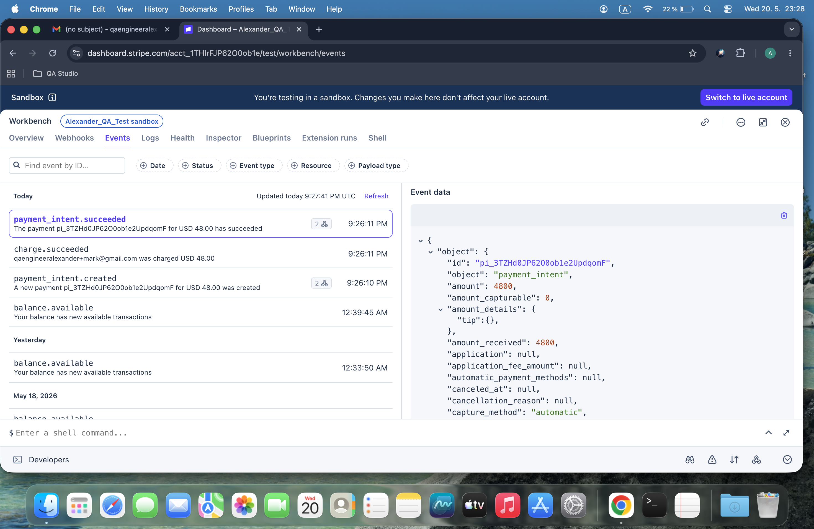
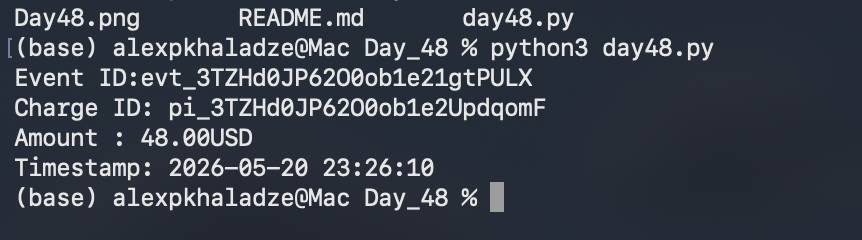

# Day 48: Advanced Webhook Ingestion & Structural Payload Validation

## Objective
The objective of Day 48 was to move from static payload simulation to real-world event synchronization by analyzing raw JSON payload objects triggered natively from the Stripe Sandbox log stream. The technical focus involved extracting live production webhook hashes, intercepting multi-layered target keys, and implementing an automated validation pipeline script (`day48.py`) to parse, match, and log deep payload trees while enforcing explicit schema verification.

## Technical Tasks
- **Production Event Auditing:** Dispatched a successful charge event sequence inside the Stripe dashboard to trigger an authentic asynchronous backend log mutation.
- **Deep JSON Schematization:** Extracted full payload structures containing critical nested meta objects like currency variables, specific merchant account routes, and epoch timestamps.
- **Defensive Parsing Pipeline:** Engineered a Python processing engine designed to validate high-level event properties sequentially before initiating data transformations, neutralizing runtime missing-key exceptions.

## Visual Documentation

### 1. Stripe Workbench: Live Real Webhook Payload Object

### 2. Automated Validation Pipeline Execution Report

## Key Learning
- **Defensive Type Handling:** Mastered programmatic validation practices by isolating and scanning high-level dictionary indexes before running nested schema operations.
- **Epoch Time Conversion:** Gained absolute control over chronological record tracking by converting platform epoch timestamps into human-readable local system strings.
- **Production Ingestion Simulation:** Built production-ready microservice layers ready to serve as secure API endpoints for real-time third-party platform alerts.
