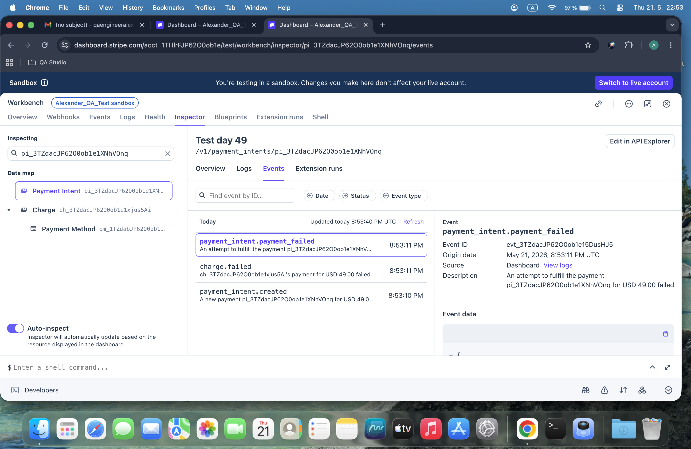
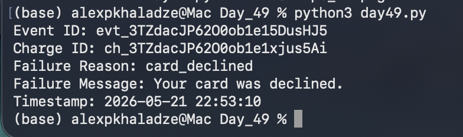

# Day 49: Asynchronous Error Ingestion & Negative-Path Webhook Parsing

## Objective
The core objective of Day 49 was to implement absolute fault tolerance within our webhook handling systems by analyzing negative-path transactional actions (`charge.failed`). The assignment involved triggering simulated credit card rejections inside the Stripe Sandbox using programmatic failure tokens (`tok_chargeDeclined`), intercepting the resulting nested error event blocks, and engineering an automated structural parser (`day49.py`) to systematically dissect exception payloads.

## Technical Tasks
- **Negative-Path Event Ingestion:** Executed custom authorization mutations to intentionally trigger a card decline flow on the server side.
- **Error Object Extraction:** Traced and isolated the nested `last_payment_error` data structures embedded deep within Stripe's runtime `payment_intent` payload layers.
- **Diagnostic Logging Automation:** Coded an analytical validation script to pull distinct error signatures including top-level event trackers, specific decline codes, and merchant-facing messages.

## Visual Documentation

### 1. Stripe Workbench: Asynchronous Failure Event Stream Logs

### 2. Automated Pipeline Diagnostic Execution Report

## Key Learning
- **Defensive API Schema Digging:** Mastered the structural techniques required to navigate deeply dynamic arrays where properties (like error blocks) change attributes contextually based on the event status.
- **Fintech Error Architecture:** Gained actionable knowledge analyzing real-world gateway rejection models, paving the way for intuitive customer retries and failure communication structures.
- **Production Boundary Defense:** Verified that backend storage architectures remain structurally secure and uniform regardless of successful or negative outcome signals.
