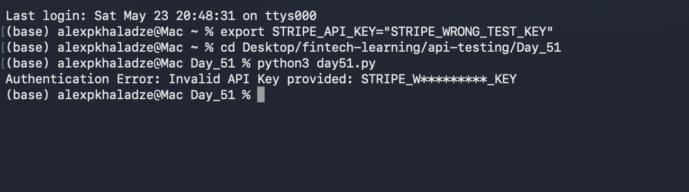
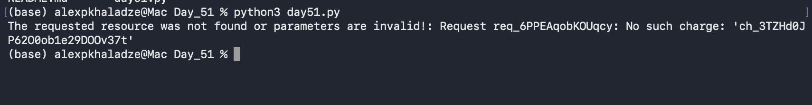
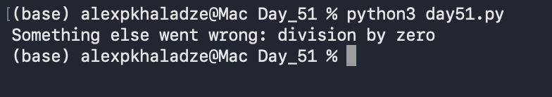

# Day 51: Defensive Exception Handling & API Fault Tolerance

## Objective
The core objective of Day 51 was to transition our programmatic integrations from fragile operations into highly resilient production architectures by implementing multi-layered error interceptors. The task involved auditing early sandbox communication modules, identifying failure-prone network boundaries, and developing a Python diagnostic gateway layer (`day51.py`) utilizing explicit exception catching to isolate authentication failures and invalid request schemas.

## Technical Tasks
- **Systemic Vulnerability Auditing:** Reviewed historical platform scripts to catalog structural failure vectors including network timeouts, token expirations, and object reference exceptions.
- **Polymorphic Error Handling:** Engineered a targeted `try-except` block parsing workflow to intercept fine-grained API issues wrappered inside standard system calls.
- **Fault-Injection Testing:** Purposely injected malformed server tokens to simulate integration breaches and verify the behavioral validity of defensive fallback configurations.

## Visual Documentation

### 1. Automated Pipeline: Authentication Failure Diagnostic Report

### 2. Automated Pipeline: Invalid Request Schema Trace

### 3. Automated Pipeline: Generic System Exception Block

## Key Learning
- **Granular Exception Prioritization:** Mastered pythonic error hierarchies by routing narrow vendor exceptions (such as `stripe.error`) cleanly before exposing base platform handlers.
- **Structural Integrity Retention:** Understood that implementing defensive middleware guarantees core application persistence and prevents memory leaks during remote third-party service crashes.
- **Diagnostic Telemetry Extraction:** Learned to pull runtime failure strings to build automated internal alert logs for instant merchant ecosystem alerting.
