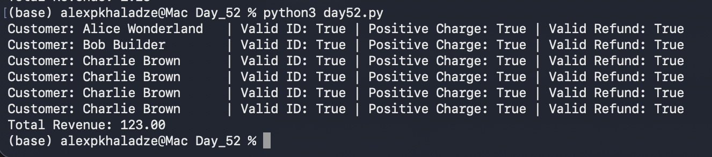

# Day 52: Data Integrity Gateways & Financial Ledger Validation

## Objective
The core focus of Day 52 was to architect defensive validation logic inside our analytics engine to protect reporting models against corrupt database entries, NULL anomalies, or logically broken ledger states (e.g., negative billing or orphan refunds). The task involved refactoring our historical multi-table revenue script (`day45.py`) into a validation-driven calculation structure (`day52.py`) that strictly enforces data rules before allowing pipeline execution.

## Technical Tasks
- **Relational Integrity Auditing:** Analyzed data fields to map breaking scenarios caused by missing tracking numbers, empty fields, or zeroed matrix results.
- **Multi-Layer Validation Gateway:** Engineered programmatic assertions verifying three structural financial invariants:
  1. Presence of a valid `stripe_customer_id` hash string.
  2. Affirmation that the accumulated transaction metric represents a strict positive integer (`amount_cents > 0`).
  3. Dynamic matching ensuring zero or partial transaction reverse values never exceed the initial capture baseline (`refund <= charge`).
- **Conditional Ledger Processor:** Developed an inline logic gate to log the status of each data check and block execution on bad records while processing good ones.

## Visual Documentation

### 1. Automated Pipeline: Data Validation Status & Ledger Report

## Key Learning
- **Fintech Data Invariants:** Understood that reporting automation must enforce mathematical boundaries (like ensuring a refund cannot exceed a charge) to guarantee ledger balancing.
- **NULL Value Defensiveness:** Mastered fallback checking techniques to cleanly separate operational profiles without breaking calculations on users with missing histories.
- **Data Isolation Rules:** Learned how isolating faulty transactional lines from aggregate metrics prevents downstream revenue calculations from reporting wrong balances.
