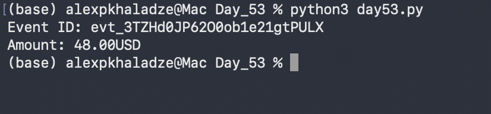
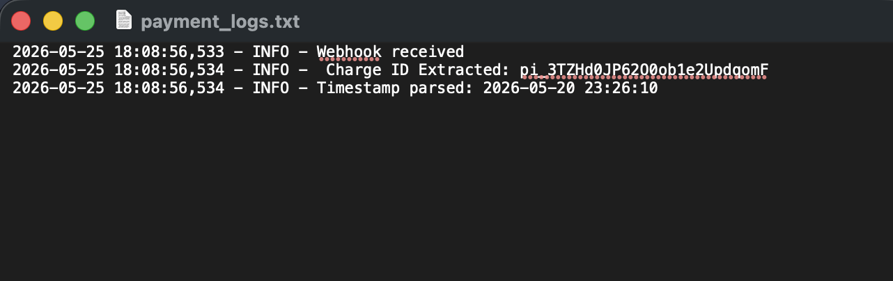

# Day 53: Production-Grade Application Logging & Audit Trails

## Objective

The core objective of Day 53 was to transition our financial automation workflows from simple console scripts to production-ready services by introducing structured event logging. The task involved refactoring our webhook verification engine (`day48.py`) into an auditable runtime monitoring service (`day53.py`) that pipes pipeline events, telemetry extractions, and structural failures simultaneously to terminal interfaces and persistent ledger files (`payment_logs.txt`).

## Technical Tasks

- **Structured System Logging:** Initialized Python's native `logging` sub-framework with standardized formats (`asctime`, `levelname`, `message`) and security thresholds (`INFO`, `ERROR`).

- **Telemetry Ingestion Auditing:** Programmed distinct telemetry capture flags inside the JSON parsing loop to trace input event sequences, isolated payment intent targets, and mapped chronological records.

- **Persistent Output Piping:** Constructed a dual-stream architecture that outputs live transaction states to console interfaces while appending audit trails seamlessly into a tracking document.

## Visual Documentation

### 1. Automated Pipeline: Terminal Runtime Stream Output

### 2. File Ingestion Audit Ledger: Persistent payment_logs.txt Format

## Key Learning

- **Persistent Audit Compliance:** Understood that standard console output is highly volatile and production financial engines require write-to-file logic to retain logs for troubleshooting.

- **Standard Logging Frameworks:** Mastered the advantages of utilizing structured, timestamped logs instead of native output functions to separate debugging messages from operational status warnings.

- **Traceability in Cloud Operations:** Realized how tracking chronological parameters enables security investigators to map exact system performance patterns during platform errors.

