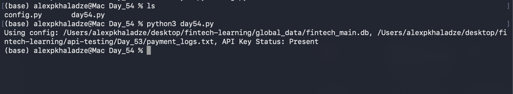

# Day 54: System Decoupling & Configuration Architecture

## Objective
The core objective of Day 54 was to transition our monolithic application modules into clean, production-grade architectures by eliminating hardcoded dependencies. The task involved refactoring static paths and environment variables out of operational logic, centralizing environment variables inside a dedicated configuration gate (`config.py`), and consuming these global state parameters dynamically through a streamlined pipeline engine (`day54.py`).

## Technical Tasks
- **Monolithic Dependency Auditing:** Inspected historical scripts from Days 31–53 to isolate code vulnerabilities tied to hardcoded database files, token keys, and static fallback parameters.
- **Centralized Configuration Gateway:** Engineered `config.py` to serve as a single source of truth, managing runtime credentials, absolute database storage targets, persistent logging paths, and client webhook timeout thresholds.
- **Dynamic Variable Ingestion:** Refactored runtime components to import abstracted configuration settings natively, ensuring that changes to environment states require zero modifications to core business logic code.

## Visual Documentation

### 1. Automated Pipeline: Configuration Verification Matrix

## Key Learning
- **Separation of Concerns (SoC):** Mastered architectural decoupling by strictly dividing global system configurations from core functional automation logic.
- **Environment Agnosticism:** Understood that stripping absolute paths and platform parameters from logical blocks allows codebases to run seamlessly across local sandboxes, staging systems, and cloud production grids.
- **Security Perimeter Enforcement:** Realized how isolating API key checks inside distinct configuration files prevents accidental credential leaks during public version-control pushes.
