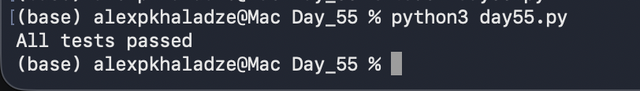

# Day 55: Behavioral Assertions & Automated Pipeline Testing

## Objective
The core objective of Day 55 was to implement automated state assertions inside our transaction runtime environments, shifting from standard conditional logging to structured validation tests. The assignment involved combining historical exception boundaries (`day51.py`) and processing data logic (`day52.py`) into a specialized validation workflow (`day55.py`) using native Python `assert` configurations to evaluate operational parameters in real time.

## Technical Tasks
- **Assertion Engine Integration:** Authored strict state verification gates using inline logical criteria to evaluate system data profiles before execution.
- **Transactional State Invariants:** Implemented three baseline pipeline rules:
  1. Enforcing structural presence of critical financial record indices (`charge_id is not None`).
  2. Verifying financial matrix attributes map to actual positive value spaces (`amount > 0`).
  3. Restricting status results to strict legitimate transactional states (`succeeded` or `failed`).
- **Defensive Failure Interception:** Wrapped evaluation checks inside defensive `try-except AssertionError` components to safely output diagnostic trace parameters instead of crashing backend runtime loops.

## Visual Documentation

### 1. Automated Pipeline: Assertion Invariant Pass Report

## Key Learning
- **Defensive Unit Testing Constraints:** Understood how embedding systematic mathematical and string assertions serves as a secure, immediate monitoring unit inside financial pipelines.
- **Assertion Failure Trapping:** Mastered practices for handling validation checks using structural exception guards, maintaining total system visibility during validation state drops.
- **Fail-Fast Software Philosophy:** Realized the critical necessity of isolating and shutting down flawed processes instantly before invalid values pollute transactional database clusters.
