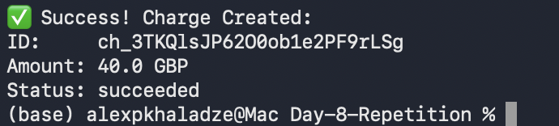

	# Stripe API Testing - Day 4

This folder contains API request tests performed using Postman.

## Requests Performed:
1. **Create Successful Charge**: Verified payment processing with a valid test card.
2. **Create Declined Charge**: Verified system behavior when a card is declined.
3. **Retrieve Charge Details**: Fetched details of an existing transaction using its ID.

## Screenshots:

---

## Day 5: Refund Flow & Verification
In this session, I handled the post-payment lifecycle by processing a refund and verifying its status.

1. **Create Refund**: Sent a `POST` request to `/v1/refunds` using a specific Charge ID (`ch_...`).
2. **Retrieve Refund Status**: Verified the refund details and confirmed the status via a `GET` request.

### Screenshots (Day 5):

### Key Takeaway:
Successfully linked a refund to an existing charge and confirmed that Stripe correctly updates the transaction's lifecycle status to reflect the reversal of funds.

---

## Day 6: Stripe API Python Setup
Transitioned from Postman to automation using the **Stripe Python SDK**.

1. **Environment Configuration**: Set up secure API key management using environment variables.
2. **Charge Creation**: Successfully automated a $25.00 payment via a Python script.

### Files & Screenshots (Day 6):
* [Python Code](./Day-06-Stripe-Charge-Creation-Basics/stripe_test_day6.py)
* 

---

## Day 7: Stripe API Error Handling
Focused on system resilience and handling payment failures.

1. **Simulated Failure**: Used `tok_chargeDeclined` to trigger an intentional card rejection.
2. **Exception Handling**: Implemented `try-except` blocks to catch and display user-friendly error messages from Stripe's API.

### Files & Screenshots (Day 7):
* [Python Code](./Day-07-Stripe-API-Error-Handling/stripe_test_day7.py)
* 

### Key Takeaway:
Learned that robust API integration isn't just about successful paths, but also about gracefully managing real-world scenarios like declined cards.

# Day 8: Stripe API Practice (Repetition)

Today I practiced handling successful and declined payments using the Stripe Charge API.

### Successful Payment
* [Success Case Code](./Day-8-Repetition/practice_success.py)

### Declined Payment (Error Handling)
* [Error Case Code](./Day-8-Repetition/practice_error.py)

---
## Day 9: Stripe Refund Automation

### Overview
In this exercise, I automated the process of creating a charge and then immediately issuing a refund using the Stripe Python API. This simulates a common fintech scenario where a transaction needs to be reversed.

### Code Implementation
The script performs the following:
1. Connects to Stripe API using environment variables.
2. Creates a charge of $50.00.
3. Captures the Charge ID.
4. Issues a full refund for that specific Charge ID.

### Implementation & Results
* [Refund Script Code](./Day-09-Stripe-Refund-Automation/stripe_refund.py)

