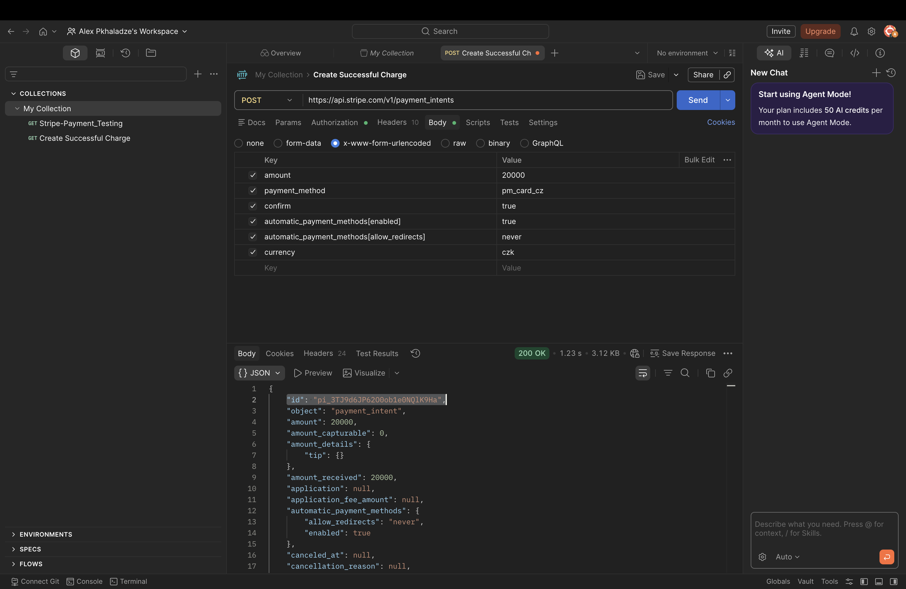
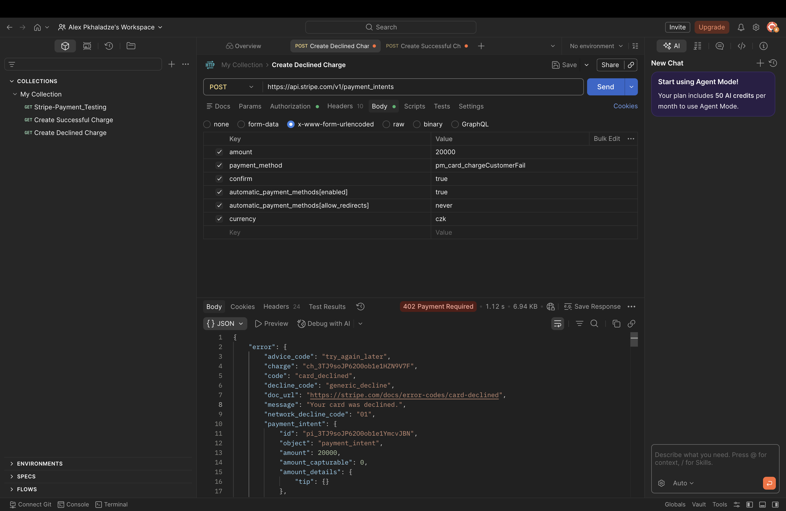
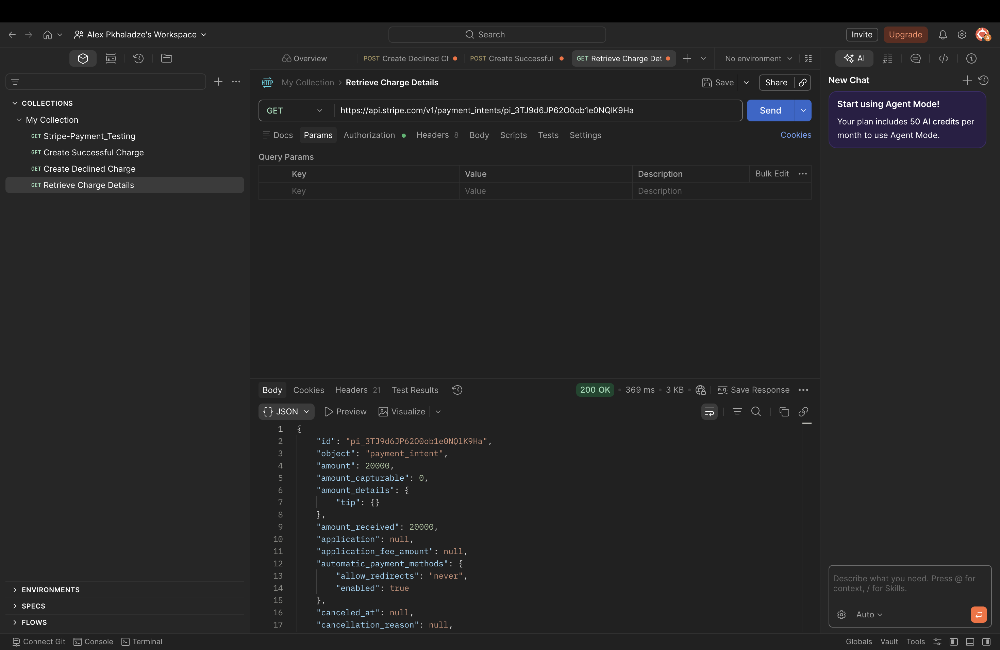

# Stripe API Testing - Day 4

This folder contains API request tests performed using Postman.

## Requests Performed:
1. **Create Successful Charge**: Verified payment processing with a valid test card.
2. **Create Declined Charge**: Verified system behavior when a card is declined.
3. **Retrieve Charge Details**: Fetched details of an existing transaction using its ID.

## Screenshots:

---

## Day 5: Refund Flow & Verification
In this session, I handled the post-payment lifecycle by processing a refund and verifying its status.

1. **Create Refund**: Sent a `POST` request to `/v1/refunds` using a specific Charge ID (`ch_...`).
2. **Retrieve Refund Status**: Verified the refund details and confirmed the status via a `GET` request.

### Screenshots (Day 5):

### Key Takeaway:
Successfully linked a refund to an existing charge and confirmed that Stripe correctly updates the transaction's lifecycle status to reflect the reversal of funds.