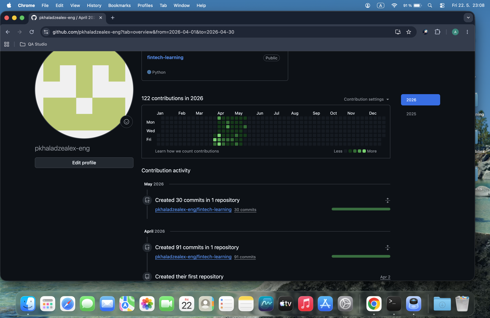

#  Milestone: Day 50 FinTech API Engineering Progress Review

##  Objective

Milestone Day 50 marks the official half-way completion of the program. The core objective was to perform a comprehensive retrospective audit of the entire backend codebase engineered across Days 31–50, map the progression of structural complexity, compile a complete script manifest, and evaluate the evolution from basic API scripts to decoupled, validation-driven financial microservice architectures.

---

##  Technical Progress Manifest (Days 31–50)

Here is the exact sentence-by-sentence analysis of the 20 distinct automation scripts built over the past 20 days:

1. **`day31.py`**: Established the baseline integration with Stripe's backend by fetching and testing authentication against live sandbox account arrays.

2. **`day32.py`**: Built the initial structural mapping suite to search, analyze, and retrieve individual active payment logs.

3. **`day33.py`**: Engineered a complete automated pipeline to programmatically register individual client objects with structured data profiles.

4. **`day34.py`**: Implemented a structural customer query engine utilizing backend identifiers to fetch and display isolated merchant profiles.

5. **`day35.py`**: Constructed a functional customer matrix modification suite to dynamically update live email variables via the API.

6. **`day36.py`**: Developed a secure customer lifecycle deletion script designed to scrub customer records from the test ecosystem cleanly.

7. **`day37.py`**: Programmed an isolated credit card payment automation routine using official validation tokens to complete succeeded charges.

8. **`day38.py`**: Created a relational data-mapping utility that binds generated transactions to distinct client object targets.

9. **`day39.py`**: Built an asynchronous reverse-settlement engine to process automated refunds against historical charge targets.

10. **`day40.py`**: Designed a multi-layered financial transaction script capable of handling programmatic variations in charge amounts and metadata attributes.

11. **`day41.py`**: Formulated a continuous batch automation script that executes sequential payment workflows using parameterized iteration arrays.

12. **`day42.py`**: Integrated an embedded SQLite engine to automatically establish local storage mirrors of cloud payment entities.

13. **`day43.py`**: Developed a data migration utility capable of updating structural column metrics across pre-existing database tables without losing continuity.

14. **`day44.py`**: Implemented complex SQL aggregation models utilizing `SUM` and `COUNT` functions to calculate lifetime value parameters directly in DB.

15. **`day45.py`**: Engineered an advanced multi-table reporting pipeline using `LEFT JOIN` and `COALESCE` to generate precise net-revenue audits across active user registers.

16. **`day46.py`**: Built a polymorphic event-routing pipeline designed to parse asymmetrical JSON data structures based on webhook action categories.

17. **`day47.py`**: Programmed a structural event lookup dictionary system mapping operational definitions, triggers, and payload parameters for payment QA matrices.

18. **`day48.py`**: Developed a defensive validation framework executing explicit validation routines and transformation models on real-time charge events.

19. **`day49.py`**: Engineered a negative-path diagnostic handler engineered to extract error parameters, fault codes, and logs from failed transaction webhooks.

20. **`day50-milestone.md`**: Constructed a centralized milestone evaluation dashboard tracking total engineered codebases, repository metrics, and system insights.

---

##  Visual Documentation

### 1. GitHub Contributions Graph & 50 Commits Milestone

---

##  Core Engineering Reflections

### 1. Structural Evolution: Day 30 vs Day 50

On Day 30, my relationship with backend automation was fundamentally basic—scripts were written as simple, linear, synchronous operations that processed standalone API actions without local context or long-term persistence. Today, on Day 50, my mindset is that of a **Systems Architect**. I look at software through the lens of data integrity, state normalization, error tracing, and defensive validation. The code I write now doesn't just call APIs; it mirrors cloud operations locally, runs complex multi-table relational joins, guards against missing data keys, and dynamically interprets system failures.

### 2. How My Understanding Has Grown

My technical evolution over these 20 days expanded across three clear layers:

- **Relational Integrity:** Moving away from flat, unstructured text dumps to highly secure database architectures enforcing `Primary Keys` and strict column definitions.

- **Asynchronous Workflow Processing:** Transitioning from polling data via standard APIs to setting up resilient parsing layers designed to handle real-world, deeply nested Webhook structures.

- **Defensive Engineering:** Learning to never trust external payload patterns blindly, choosing instead to enforce proactive confirmation models, structural fallbacks, and conditional exception routines.

---

##  The Next Horizon (Beyond Day 50)

Now that the baseline of payment mechanics, relational database management systems (RDBMS), and raw webhook payload validation is thoroughly mastered, the next architectural step is building active server endpoints. The target is to transition from isolated local Python scripts into hosting real-time **Flask or FastAPI backend systems** capable of exposing public URLs to receive live Webhook streams directly from Stripe servers, validating authorization hashes on the fly, and running asynchronous operations inside production environments.

