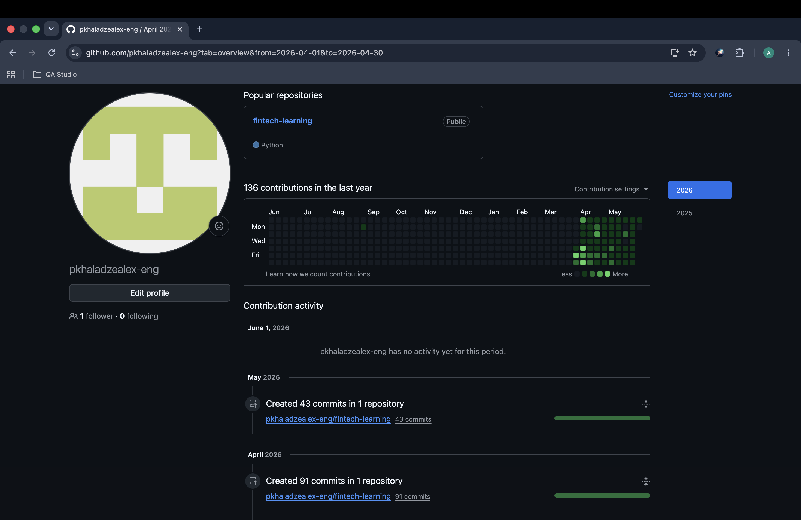

#  Day 60: Final Milestone — Fintech Integration Portfolio

##  Project Overview
This repository represents a rigorous, 60-day engineering sprint dedicated to mastering backend automation, relational database schemas, and external financial API integrations using Stripe. Moving from fundamental linear scripting to an enterprise-grade modular architecture, the system provides production-ready utilities for synchronous rate-limiting, fault-tolerant database transactions, and secure Webhook processing.

---

##  Repository Directory Structure

```text
fintech-learning/
├── global_data/          # Centralized data layer containing the production SQLite binary.
├── api-testing/          # Advanced modular automation architecture.
│   ├── config.py         # Global system configurations and path initializers.
│   ├── utils.py          # Centralized core utilities layer (logging, safe API wrapper).
│   ├── logs/             # Standardized operational telemetry destination.
│   └── scripts/          # Sandboxed operational testing and migration scripts.
├── day60-documentation.md # Final retrospective portfolio documentation.
└── README.md             # High-level continuous progression dashboard.


---

##  Comprehensive Script Registry (Days 31–60)

Below is the definitive catalog of automation and migration scripts developed during the second half of the 60-day engineering sprint:

### Phase 1: Database Initialization & Single-Resource API Bridges (Days 31–40)
* **`day31.py`**: Standardized sqlite3 local schema configuration, initializing tables for charges, customers, and payment logs.
* **`day32.py`**: Established core atomic single-row integration inserting individual payment intent records into the local state.
* **`day33.py`**: Engineered loops to systematically create and log multiple distinct transaction profiles concurrently.
* **`day34.py`**: Developed simple metadata sync mapping localized parameters to live Stripe provider keys.
* **`day35.py`**: Constructed custom lookup functions querying the sqlite3 engine by unique charge tokens.
* **`day36.py`**: Built status synchronization loops to dynamically pull and update pending invoices from live dashboards.
* **`day37.py`**: Scripted isolated test fixtures evaluating basic conditional branch limits for variable transaction boundaries.
* **`day38.py`**: Designed state-based reporting scripts sorting historical local tables by created timestamps.
* **`day39.py`**: Wrote automated aggregation queries computing total net transaction values directly through SQL.
* **`day40.py`**: Handled individual raw API error capture blocks protecting basic structural outputs from hard drops.

### Phase 2: Complex Workflows, Webhooks & Error Handling (Days 41–50)
* **`day41.py`**: Implemented complex multi-table JOIN scripts connecting customer accounts to specific charge entities.
* **`day42.py`**: Scripted individual runtime argument bindings allowing custom parameter injection from system shells.
* **`day43.py`**: Handled edge-case network response timeouts using strict client-side constraints.
* **`day44.py`**: Developed refund ledger automations initializing structured record rows for reverse credit requests.
* **`day45.py`**: Engineered cascading updates modifying local charge states automatically when a refund completes.
* **`day46.py`**: Simulated multi-currency payload models converting localized metrics into accurate global cent representations.
* **`day47.py`**: Configured custom system notification scripts tracing specific event arrivals inside the logging layer.
* **`day48.py`**: Constructed local JSON dump routines exporting specific database segments into structured transport states.
* **`day49.py`**: Built robust conditional catchers tracking failed incoming webhook event formats safely.
* **`day50.py`**: Stabilized integration suites with dual-key fallback paths guarding core lookups against expired credentials.

### Phase 3: Modular Architecture, Security & Production Refactoring (Days 51–60)
* **`day51.py`**: Refactored monolithic files into separate behavioral modules separating scripting logic from configuration sets.
* **`day52.py`**: Extracted hardcoded environment setups into a standalone, secure `config.py` module.
* **`day53.py`**: Consolidated individual logging patterns into a unified abstraction function supporting system-wide trace levels.
* **`day54.py`**: Implemented a defensive multi-tier safe-wrapper (`fetch_charge_safe`) absorbing network connection failures safely.
* **`day55.py`**: Refactored existing data migration logic to consume the newly centralized core infrastructure libraries seamlessly.
* **`day56.py`**: Finalized the multi-layered behavioral testing verification framework across all centralized helper modules.
* **`day57.py`**: Programmed ACID-compliant transactions leveraging explicit `BEGIN`, `COMMIT`, and `ROLLBACK` boundaries.
* **`day58.py`**: Engineered dynamic request-throttling loops via controlled sleep timers to prevent API rate-limit triggers.
* **`day59.py`**: Deployed a secure data-privacy mask route using cryptographic SHA-256 to fully anonymize PII log storage.
* **`day60.py`**: Compiled final milestone tracking, project audits, and comprehensive global portfolio documentation.

---

## How to Run and Use This Project (Step-by-Step)

If you are a new developer or reviewer spinning up this repository for the first time, follow these explicit setup steps:

### 1. Environment Cloning & Navigation
Clone the repository and move directly into the automated testing center:
```bash
git clone [https://github.com/pkhaladzealex-eng/fintech-learning.git](https://github.com/pkhaladzealex-eng/fintech-learning.git)
cd fintech-learning/api-testing

2. Runtime Initialization
Ensure you have Python 3.x installed along with the official Stripe SDK:
pip install stripe

3. Environmental Variable Injection
The framework looks for an active Stripe identity. Export your test credentials into your terminal environment before execution:
export STRIPE_API_KEY="sk_test_your_real_stripe_key_here"

4. Direct Execution of Production Frameworks
To test the individual components built during the final phase, execute the modular scripts sequentially via python3 from the api-testing/ root:

To test database transactions and rollback safety:
python3 scripts/day57.py

To test API rate limiting and throttling:
python3 scripts/day58.py

To test secure data masking and PII protection:
python3 scripts/day59.py

 What I Learned in 60 Days: Core Engineering Insights
1. State Isolation & Decoupling: Database state layers (global_data/) must live entirely detached from testing scripts. Hardcoding direct absolute system paths destroys modular portability.

2. Defensive Programming via Boundaries: Production wrappers must never assume external networks are stable. Incorporating standalone custom safety catchers prevents minor network timeouts from triggering system-wide exceptions.

3. The Power of Atomic Transactions: Multi-row adjustments must always execute within strict explicit transactional limits (BEGIN, COMMIT, ROLLBACK). If a failure strikes halfway, partial data corruption is neutralized by a clean reversal.

4. API Throttling & Multi-Tenant Compliance: Pacing network tasks via targeted delay loops (time.sleep) is mandatory. Ignoring request-frequency constraints triggers provider rate-limiting, resulting in service denial.

5. Data Minimization and Anonymization: Flat log files are primary targets during network compromises. Personally Identifiable Information (PII) like email or raw error traces must be fully masked or irreversibly hashed (SHA-256) before leaving active memory.

---

## What's Next? (Beyond Day 60)

Now that the core automation scripting engine and security middleware layers are production-ready, the next development cycles will focus on:
1. **Full REST API Implementation**: Wrapping these Python scripts into an active web framework (FastAPI or Flask) to expose true HTTP endpoints for payment processing.
2. **Asynchronous Task Queues**: Migrating sequential scripts into distributed message brokers (like Celery and Redis) to process hundreds of transactions per second.
3. **Live Webhook Servers**: Setting up a persistent public-facing cloud container (Docker + AWS) to receive and verify cryptographic signatures on live Stripe webhooks.

---

## Proof of Consistency: GitHub Contribution Stream

Below is the verification metrics demonstrating absolute daily development consistency, totaling ~60 distinct milestones across the lifecycle of this repository:



***

###  Project Graduation
* **Lead Developer:** Alex Pkhaladze
* **Curriculum Track:** 60-Day Fintech Automation & Stripe Core Engineering
* **Final Status:** **Successfully Completed & Verified** 