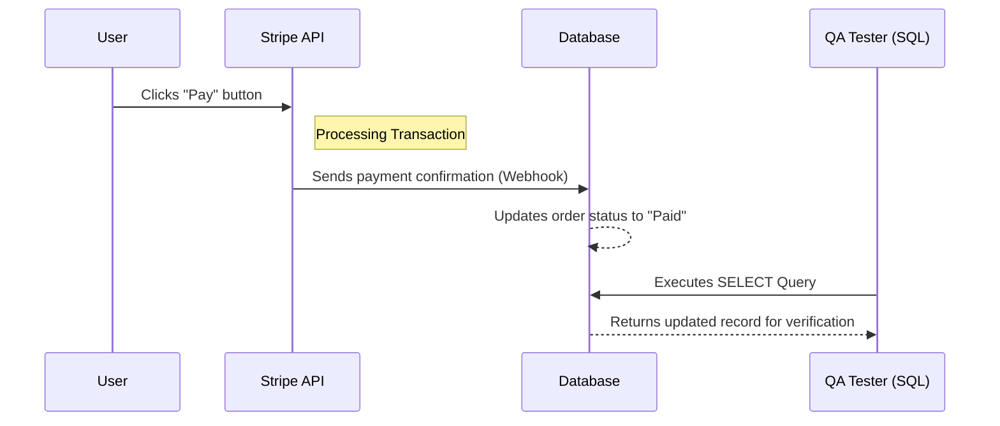

# Payment Process Flow

## Diagram


## Step-by-Step Explanation
1. **User Action:** The user initiates the payment by clicking the **"Pay"** button on the checkout page.
2. **Stripe Processing:** Stripe API securely processes the credit card information and validates the transaction.
3. **Database Update:** Once the payment is successful, Stripe sends a notification (Webhook) to the server, which then updates the **Database** (e.g., changing status from `Pending` to `Completed`).
4. **SQL Verification:** The tester runs a SQL query to verify that the database reflected the changes correctly.

## Verification Query
```sql
-- Checking the latest payment status for a specific user
SELECT order_id, status, amount, updated_at 
FROM payments 
WHERE user_id = 'user_123' 
ORDER BY updated_at DESC 
LIMIT 1;
```
