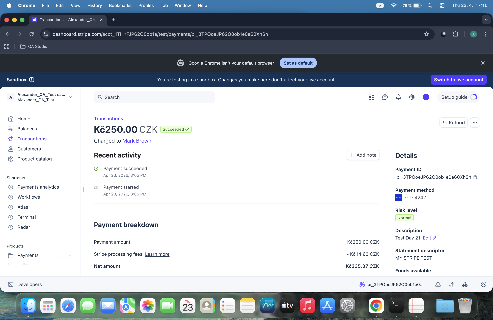
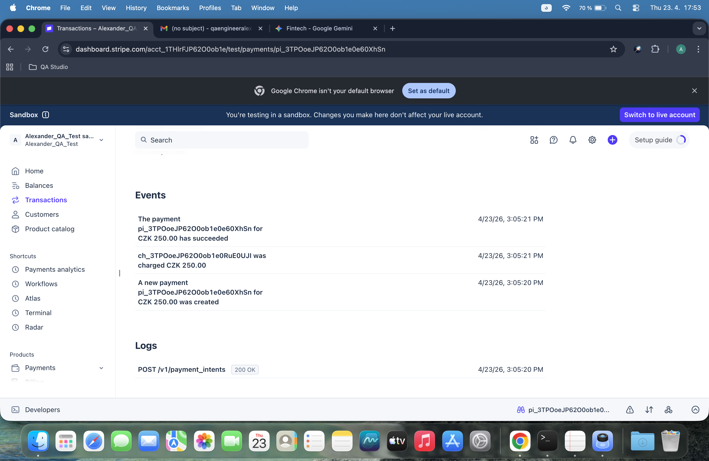
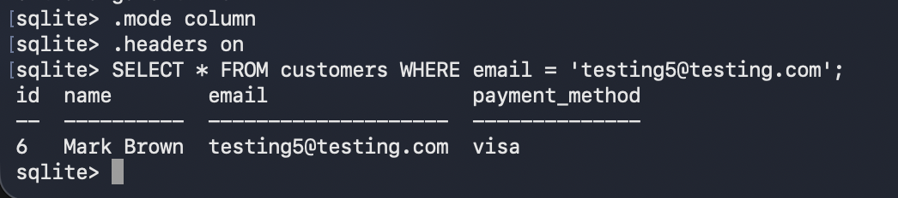

# 🧪 Test Execution Report - Day 21
**Date:** 2026-04-23
**Tester:** Alexander QA
**Test Case:** TC01 - Successful Visa Payment (Manual Simulation)
**Environment:** Stripe Test Mode & SQLite Database

---
## 1. Stripe Dashboard Verification
- **Status:** Completed ✅
- **Transaction ID:** pi_3TPOoeJP62O0ob1e0e60XhSn
- **Amount:** 250.00 CZK
- **Customer:** Mark Brown (testing5@testing.com)
- **Evidence:** 

---
## 2. Webhook & Event Log
- **Event Type:** payment_intent.succeeded
- **Status:** Processed ✅
- **Evidence:** 

---
## 3. Database Verification (SQL)
- **Database:** fintech_qa.db
- **Query:** SELECT * FROM customers WHERE email = 'testing5@testing.com';
- **Result:** Record verified successfully in the local database.
- **Evidence:** 