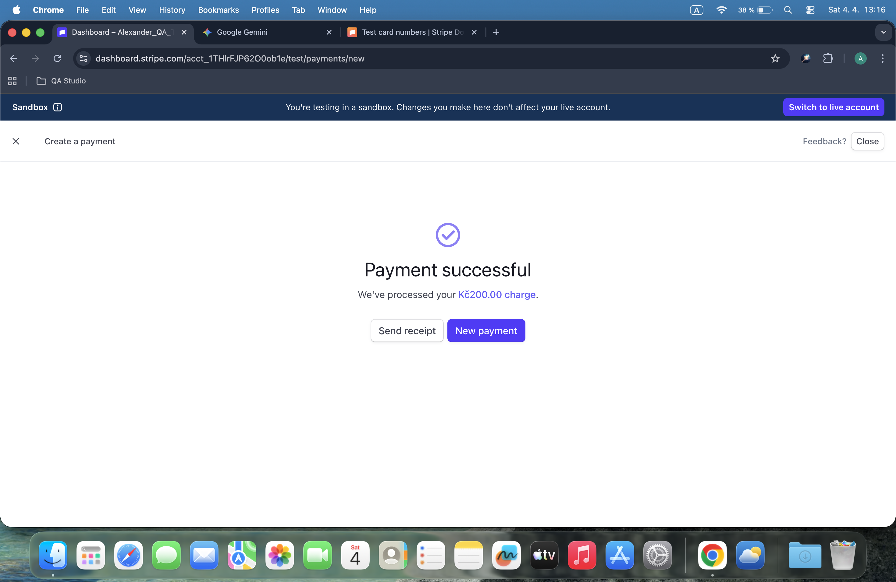
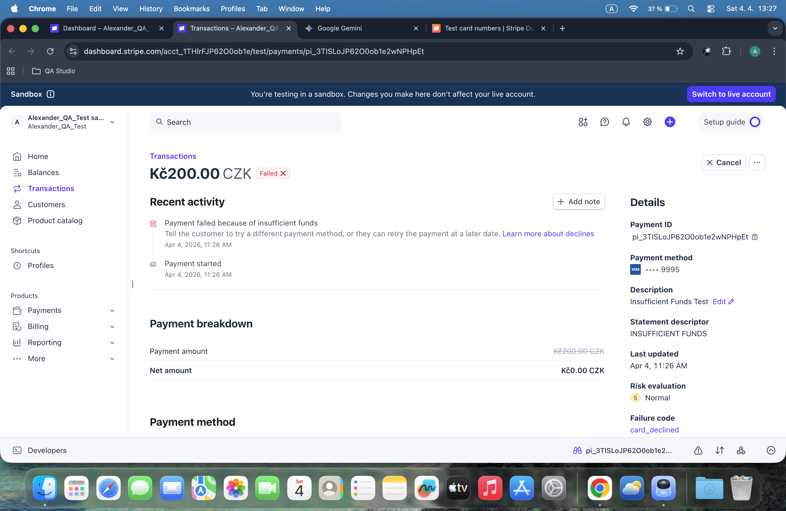
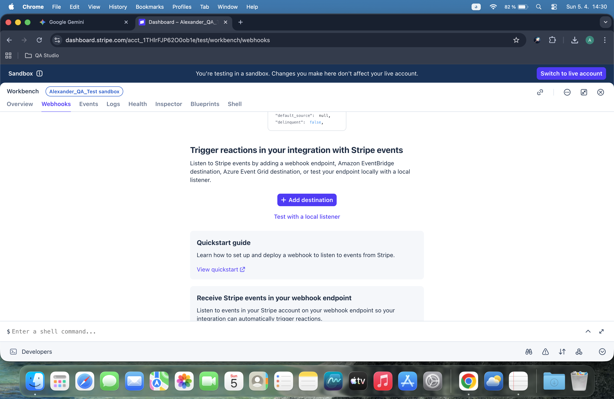

# 💳 Stripe Payment Integration & Testing Project

## 🌟 Project Overview
This project demonstrates a comprehensive QA testing process within the **Stripe Sandbox** environment. I have simulated real-world customer creation and transaction scenarios to verify system robustness and error handling.

---

## 📅 Day 1: Payment Testing Setup (Customers & Cards)
In the first phase, I focused on setting up the environment and creating test customers to cover various payment networks.

### Created Test Customers:
1. **John Doe** - Visa (`4242`)
2. **Jane Smith** - Visa (`5556`)
3. **Alex Ross** - American Express (`0005`)
4. **Sara Lane** - Mastercard (`3222`)
5. **Mark Brown** - Mastercard (`8210`)

### Why test with different card brands?
* **Validation Logic:** Ensuring the system handles 15-digit (Amex) vs 16-digit (Visa/MC) numbers.
* **Network Communication:** Verifying gateway responses across different financial networks.
* **UI/UX Feedback:** Checking if the frontend correctly identifies and displays card brand icons.

---

## 📅 Day 2: Transaction Outcome Testing
In this phase, I executed 5 manual transactions to test how the system handles different payment outcomes.

### 1. Successful Payment ✅

### 2. Declined Card ❌

### 3. Insufficient Funds 💸

### 4. Expired Card 📅

### 5. Network / Processing Error ⚠️

---

## 💡 Key Learning Outcomes
* **Stripe Test Environment:** Mastering "Magic" card numbers to trigger specific API responses.
* **Error Handling:** Understanding the importance of granular error messages (e.g., distinguishing a decline from an expiration).
* **Transaction Lifecycle:** Tracking payments from `Pending` to `Succeeded` or `Failed` in the Dashboard.
* **QA Documentation:** Implementing a structured approach to screenshot naming and Git-based reporting.

## Day 3: Stripe Webhooks & Theory

In this stage, I focused on understanding how Stripe communicates with our server using Webhooks.

### 1. Technical Concept
* **Webhook:** An automated message sent by Stripe when an event occurs (e.g., payment success).
* **Purpose:** To keep our database in sync with real-time payment statuses.

### 2. Implementation Workspace
I accessed the Stripe Workbench to review the webhook endpoints.

### 3. Documentation
Detailed explanation of webhooks can be found in [webhook_explanation.txt](webhook_explanation.txt).